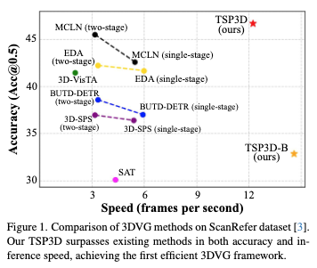
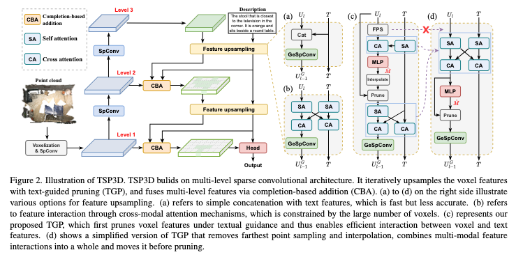

# 2025-CVPR-Text-guided Sparse Voxel Pruning for Efficient 3D Visual Grounding

这篇论文提出了一种名为 TSP3D 的高效单阶段 3D 视觉定位方法，旨在在自然语言引导下从点云中快速准确地定位目标物体。与以往基于点云或两阶段的方法不同，TSP3D 首次在该任务中引入了稀疏卷积多层架构，并设计了两个关键机制：文本引导剪枝（TGP）用于根据语言信息逐步删除无关体素，从而高效实现多模态特征交互；以及基于补全的加和（CBA）用于在目标信息被误删时自适应补全重要区域。实验表明，TSP3D 在多个基准数据集上同时实现了最优的准确率与最快的推理速度，显著提升了3D视觉定位任务的实用性与效率。

## 摘要

本文提出了一种用于3D视觉定位的高效多层卷积架构。传统的两阶段或基于点的方法难以满足实时推理的要求。受到**多层全稀疏卷积架构**在3D目标检测中取得成功的启发，我们旨在沿着这条技术路线构建一个新的3D视觉定位框架。然而，由于3D视觉定位任务中，3D场景表示应该与文本特征进行深度交互，而基于稀疏卷积的架构由于大量的voxel特征，使得这种交互效率低下。**为此，我们提出了文本引导剪枝(TGP)和基于补全的添加(CBA)，通过逐步区域剪枝和目标补全，以有效的方式深度融合3D场景表示和文本特征。具体来说，TGP迭代地稀疏化3D场景表示，从而通过交叉注意力有效地将voxel特征与文本特征进行交互。**为了减轻剪枝对精细几何信息的影响，CBA通过voxel补全自适应地修复过度剪枝的区域，计算开销可以忽略不计。与之前的单阶段方法相比，我们的方法实现了最高的推理速度，并且超过了之前最快的方法100%的FPS。即使与两阶段方法相比，我们的方法也实现了最先进的精度，在ScanRefer上Acc@0.5的领先优势为+1.13，在NR3D和SR3D上分别领先+2.6和+3.2。代码可在https://github.com/GWxuan/TSP3D上获得。

## 1. Introduction

将多模态信息融入以指导3D视觉感知是一个很有前景的方向。近年来，3D视觉定位(3DVG)，也称为3D实例引用，作为一种基础的多模态3D感知任务，受到了越来越多的关注。**3DVG的目标是用自由形式的查询描述来定位场景中的一个物体。3DVG具有挑战性，因为它需要理解3D场景和语言描述。最近，随着3D场景感知和视觉-语言模型的发展，3DVG方法已经取得了显著的进展。然而，由于3DVG被广泛应用于机器人和AR/VR等领域，在这些领域中，推理速度是主要的瓶颈，因此如何构建高效的实时3DVG模型仍然是一个具有挑战性的问题。**

由于3DVG的输出格式与3D目标检测相似，早期的3DVG方法通常采用两阶段框架，首先进行检测以定位场景中的所有物体，然后通过结合文本信息来选择目标物体。**由于3D目标检测和3DVG之间存在许多相似之处(例如，它们都需要提取3D场景的表示)，因此在独立采用这两种模型时，会产生大量的冗余特征计算。**因此，两阶段方法通常难以处理实时任务。**为了解决这个问题，提出了单阶段方法，该方法直接从点云生成目标的bounding box。这种集成设计更加紧凑和高效。<u>**然而，当前单阶段3DVG方法主要建立在基于点的架构之上，其中特征提取包含诸如最远点采样和kNN等耗时操作。他们还需要积极地对点特征进行下采样以降低计算成本，这可能会损害小而薄物体的几何信息。</u>由于这些原因，当前的单阶段方法仍然远未达到实时（＜6 FPS），并且它们的性能不如两阶段方法，如图1所示。

在本文中，我们提出了一种新的基于文本引导的稀疏体素剪枝的3DVG单阶段框架，即TSP3D。受到最先进的3D目标检测方法的启发，该方法通过多层稀疏卷积架构实现了领先的精度和速度，**我们构建了第一个稀疏单阶段3DVG网络。**然而，与3D目标检测不同，在3DVG中，3D场景表示应该与文本特征进行深度交互。**由于基于稀疏卷积的架构中的体素数量非常大，因此诸如交叉注意力之类的深度多模态交互由于无法承受的计算成本而变得不可行。为此，我们提出了文本引导剪枝（TGP），该方法首先利用文本信息来共同稀疏化3D场景表示并增强体素和文本特征。**为了减轻剪枝对精细几何信息的影响，**我们进一步提出了基于补全的添加（CBA）来自适应地修复过度剪枝的区域，而计算开销可忽略不计。**具体来说，TGP根据对象分布修剪体素特征。它逐渐删除背景特征和不相关对象的特征，从而生成目标对象周围的文本感知体素特征，以实现精确的边界框预测。由于剪枝可能会错误地删除目标对象的表示，因此CBA利用文本特征从完整的骨干特征中查询一小组体素特征，然后进行剪枝感知添加以修复过度剪枝的区域。我们对流行的ScanRefer和ReferIt3D数据集进行了广泛的实验。与之前的单阶段方法相比，TSP3D实现了最高的推理速度，并且超过了之前最快的单阶段方法100％的FPS。即使与两阶段方法相比，TSP3D也实现了最先进的精度，在ScanRefer上Acc@0.5的领先优势为+1.13，在NR3D和SR3D上分别领先+2.6和+3.2。

总而言之，我们的主要贡献如下：

- 据我们所知，这是第一项探索用于有效3DVG的稀疏卷积架构的工作。
- 为了实现有效的特征提取，我们提出了文本引导剪枝和基于补全的添加来稀疏化稀疏体素并自适应地融合多层特征。
- 我们进行了广泛的实验，并且TSP3D在准确性和速度方面均优于现有方法，证明了所提出框架的优越性。

## 2. Related Work

### 2.1. 3D Visual Grounding

3D视觉定位旨在根据自然语言描述定位3D场景中的目标对象。现有的方法通常分为两阶段和单阶段方法。**两阶段方法遵循检测然后匹配的模式。**在第一阶段，他们使用预训练的语言模型独立地从语言查询中提取特征，并使用预训练的3D检测器或分割器预测候选3D对象。在第二阶段，他们专注于对齐视觉和文本特征以识别目标对象。特征融合技术包括使用Transformer的注意力机制、对比学习和基于图的匹配。相反，**单阶段方法集成了对象检测和特征提取，从而可以直接识别目标对象。**此类方法包括使用文本特征引导关键点选择，以及借鉴2D图像-语言预训练模型（如GLIP）测量单词和对象之间的相似性，如BUTD-DETR中所示。EDA和G3-LQ等方法通过显式文本解耦、密集对齐和语义几何建模来增强多模态特征的可区分性，从而推进了单阶段3D视觉定位。MCLN使用3D指代表达式分割任务来辅助3DVG，从而提高性能。然而，现有的两阶段和单阶段方法通常具有较高的计算成本，从而阻碍了实时应用。我们的工作旨在通过提出一种具有多层稀疏卷积架构的高效单阶段方法来应对这些效率挑战。

### 2.2. Multi-Level Convolutional Architectures

最近，稀疏卷积架构在3D对象检测领域取得了巨大的成功。**基于体素表示和稀疏卷积运算，此类方法在处理场景级数据时表现出极高的效率和准确性。**GSDN首先在3D对象检测中采用具有生成特征上采样的多层稀疏卷积。FCAF3D通过无锚点设计简化了多层架构，从而实现了领先的准确性和速度。TR3D通过删除不必要的层并引入类别感知的提议分配方法来进一步加速FCAF3D。此外，DSPDet3D将多层架构引入到3D小对象检测中。我们提出的方法从这些方法中汲取灵感，利用具有稀疏卷积和无锚点设计的稀疏多层架构。这样可以有效地处理3D数据，从而在3D视觉定位任务中实现实时性能。

> **体素（Voxel）**是三维空间中的像素（pixel）概念的扩展，全称是 **Volumetric Pixel**。通俗地说，体素就像是三维空间中的一个小立方体单位，它是将三维空间离散化的最基本单位。
>
> 在二维图像中，图像由一个个像素构成，每个像素表示平面上的一个小格子；
>
> 在三维场景中，为了处理三维数据（比如点云、MRI、CT 扫描、3D建模等），我们将整个空间划分为一个个等大小的小立方体，每个立方体就叫做一个 **体素**。

## 3. Method

在本节中，我们提出了TSP3D这一用于高效单阶段3D视觉引导（3DVG）的方法。首先分析了现有的pipeline，明确当前的挑战，并据此激发了我们的方法设计（第3.1节）。随后，介绍了**文本引导剪枝**，它通过利用文本特征引导特征剪枝（第3.2节）。针对关键特征被剪枝造成的信息损失风险，提出了**基于补全的多层特征融合**机制（第3.3节）。最后，详细介绍了整体训练损失的设计（第3.4节）。

### 3.1 用于3DVG的架构分析

当前性能最优的3DVG方法以两阶段为主：即3D对象检测与3D对象定位的串行组合。这种方法的缺点在于，两步独立执行导致特征提取重复、pipeline复杂，从而大幅拉低整体效率。在ScanRefer等数据集上的代表性方法准确性和速度对比如图1所示。可见，由于额外的检测阶段，两阶段方法推理速度较慢（＜3 FPS）。而3D视觉定位常应用于资源有限的实际场景（如具身机器人和VR/AR），因此两阶段方案在实际中较难部署。

相较之下，单阶段方法因流程简化，可直接从输入的3D场景预测参考框，更加高效。从图1可见，单阶段方法在效率上遥遥领先于两阶段方案。

然而，现有单阶段方法普遍依赖基于点的backbone，其场景表示仍需要最远点采样、集合抽象等耗时操作，并屡次采用大型Transformer解码器进行文本与3D特征融合，多次迭代。这使得当前单阶段3DVG的推理速度距离实时要求仍有较大差距（＜6 FPS）。具体各部分的速度分析可见补充材料。

受3D对象检测领域多层稀疏卷积架构的启发，后者以领先的精度和速度著称，我们建议构建首个**多层稀疏卷积架构的单阶段3DVG pipeline**。

------

#### TSP3D-B：基于稀疏卷积的Baseline框架

具体地，我们提出了基于稀疏卷积的baseline框架TSP3D-B。该结构借鉴FCAF3D的多层架构，利用3级稀疏卷积块完成场景表征提取与bounding box预测（见图2(a)）。主要流程如下：

- 输入点云 $P \in \mathbb{R}^{N \times 6}$（3D位置+RGB，共6维特征）首先体素化；
- 经三个连续的MinkResBlock处理，获得三层体素特征 $V_l, \ l=1,2,3$，层数增加时分辨率降低、上下文增强；
- 自由格式文本信息（$l$词），通过预训练RoBERTa编码器得原始文本token $T \in \mathbb{R}^{l \times d}$；
- 在此基础上，逐步上采样$V_3$，并与$T$融合，得到高分辨率且富含文本语义的场景表示：

$$
U_l = U_G^l + V_l, \quad U_G^l = \mathrm{GeSpConv}(U_{(l+1)}')
$$

$$
U_{(l+1)}' = \mathrm{Concat}(U_{(l+1)}, T)
$$

其中，$U_3 = V_3$，$\mathrm{GeSpConv}$为生成式稀疏卷积（步长2），负责体素特征上采样和位置扩展，提升bounding box预测效果。$\mathrm{Concat}$为体素特征与文本的拼接（通过复制$T$实现）。

- 最终，上采样特征图$U_1$与$T$拼接并送入卷积头，预测对象性得分与3D bounding box回归。对象性得分最高的框为最终定位结果。

如图1所示，TSP3D-B实现14.58 FPS的推理速度，显著快于以往单阶段方法，展现出实时3DVG的巨大应用潜力。

------

### 3.2 文本引导剪枝

尽管TSP3D-B展现出较高效率，但由于3D场景表示与文本特征之间的交互有限，其性能仍有提升空间。受此前3DVG方法启发，一种直接思路是将Concat替换为跨模态注意力机制处理体素与文本特征，如图2（b）所示。然而，不同于基于点的架构会主动对场景表示进行下采样，多层卷积框架中体素数量往往极大。实际实验发现，体素数在每次上采样后以指数级增长，导致场景特征上的自注意和交叉注意计算负担巨大。

**为应对这一挑战，我们提出了“文本引导剪枝”（Text-guided Pruning，TGP）机制，构建完整TSP3D架构（见图2（c））。**TGP的核心思想是通过剪枝冗余体素，减少特征数量，并利用文本特征逐步引导网络关注最终目标对象。

#### 总体架构

TGP可以视作跨模态注意力的改进版本，其出发点是在注意力操作前减少体素数量以降低算力开销。我们提出的剪枝过程是“逐步”的：

- 在体素数量尚少的高层级，剪枝较为温和；
- 在低层级（体素数因上采样暴增），则更强力度修剪。
   TSP3D多层结构共3级，包含2次特征上采样，因此我们相应设计了2类TGP：
- **场景级TGP（level 3→2）**：区分对象与背景，更着重剪掉背景体素；
- **目标级TGP（level 2→1）**：重点关注文本中提及区域，保留参考目标及相关体素，其他部分删除。

#### TGP细节

由于体素是否被修剪取决于文本，我们首先让体素特征具备文本感知能力，从而预测剪枝mask。具体流程如下：

1. 对当前体素特征 $U_l$ 先用最远点采样（FPS）降采样，保留场景空间分布结构；
2. 利用**交叉注意力**与文本特征交互，再通过MLP预测体素保留概率分布 $\hat{M}$；
3. 将 $\hat{M}$ 二值化+插值，得到实际修剪后的mask，应用于特征 $U_l$：

$$
U_l^P = U_l \odot \Theta(I(\hat{M}, U_l) - \sigma) \tag{3}
$$

$$
 \hat{M} = \text{MLP}(\text{CrossAtt}(\text{FPS}(U_l), \text{SelfAtt}(T))) \tag{4} 
$$

其中 $U_l^P$ 为剪枝后的特征，$\Theta$ 为Heaviside阶跃函数，$\odot$ 为元素乘，$\sigma$ 为修剪阈值，$I$ 是插值操作（按 $U_l$ 位置），$T$ 为文本特征。

剪枝后，场景特征显著瘦身，能够使用自注意力机制进行高效内部特征交互。此后依次采用自注意力和交叉注意力，捕捉对象间关系，融合多模态特征并生成更新特征 $U'_l$。最终经上采样生成稀疏卷积，得到 $U_G^{(l-1)}$。

#### 剪枝的监督

场景级TGP和目标级TGP的目标mask如下：
$$
M_{sce} = \bigcup_{i=1}^N M(O_i), \qquad M_{tar} = M(O_{tar}) \cup \bigcup_{j=1}^K M(O_{rel}^j) \tag{5}
$$

- ${O_i | 1 \leq i \leq N}$：场景中所有对象
- $O_{tar}$、$O_{rel}$：分别为目标对象和相关对象
- $M(O)$ 表示以对象$O$中心生成的 $L \times L \times L$ 立方体mask，立方体内部值为1，其余为0

#### 简化与改进

上述TGP虽能有效修剪特征，但部分步骤效率不佳：

1. FPS在大场景中计算开销大；
2. 体素和文本有2次交互（剪枝指导+表示增强），略嫌冗余；
3. 经验上第3级体素数量很小，无需额外降采样。

**改进方案** 如图2（d），采用简化TGP：

- 删除FPS；
- 多模态交互合并为**一次**，且放于剪枝前；
- 先深度交互再剪枝，之后体素始终较少，自/交叉注意都能高效运行。

#### TGP有效性

采用TGP后，第1级体素数仅为原始体系的~7%，极大节省计算成本，并显著提升3DVG整体性能。TGP具备多重优势，即：（1）促进多模态特征交互；（2）特征量瘦身降低代价；（3）逐步指导网络聚焦于文本提及的目标区域。

------

### 3.3 基于补全的添加

在特征剪枝的过程中，某些目标（尤其是体积较小或细长的物体）可能会被误删，如图3(b)所示。因此，公式（1）中上采样剪枝特征 $U_G^l$ 和Backbone特征 $V_l$ 的**加法操作**对于缓解过度剪枝造成的损失至关重要。

#### 添加操作的替代方案

常见有两种特征加法策略：

1. **完全添加**
   - 在 $V_l$ 与 $U_G^l$ 的重叠区域，特征直接相加。
   - 对于 $U_G^l$ 或 $V_l$ 独有的体素，需通过插值补全缺失特征后再参与相加。
   - 这种方式能全面修复剪枝导致的缺失区，但计算开销大，也可能削弱模型对目标区域的关注度，违背TGP的设计初衷。
2. **剪枝感知添加**
   - 加法仅限于 $U_G^l$ 的位置。
   - 若 $U_G^l$ 中的体素在 $V_l$ 中不存在，则通过插值方式填补 $V_l$ 的对应特征。
   - 该方案限定了保留区域，效率较佳，但可能因过度依赖剪枝结果，错失被误裁剪的重要目标部位。

#### 基于补全的添加（CBA）

针对完全添加和剪枝感知添加的不足，我们提出**基于补全的添加（Completion-based Addition, CBA）**。CBA专为多层特征集成而设计，旨在以计算高效的方式保留关键细节，有效弥合剪枝不当带来的结构损失。

##### CBA流程详述

1. **特征增强：**
   - 先对Backbone特征 $V_l$ 通过交叉注意力与文本特征 $T$ 进行融合，生成增强的 $V'_l$。
2. **目标区域预测：**
   - 采用MLP预测体素为目标区域的概率分布，并二值化得到mask：
      $$ M_{tar}^l = \Theta(\mathrm{MLP}(V'_l) - \tau) \tag{6} $$ 其中 $\Theta$ 为阶跃函数，$\tau$ 为阈值。
3. **缺失体素识别：**
   - 比较 $M_{tar}^l$ 与 $U_G^l$，确定剪枝导致的目标区域缺失mask： $$ M_{mis}^l = M_{tar}^l \land (\lnot C(U_G^l, V_l)) \tag{7} $$ 其中 $C(A,B)$ 表示在 $B$ 的空间上标记 $A$ 中存在特征的位置。
4. **缺失体素补全：**
   - 对于存在于 $M_{mis}^l$ 中的目标区域缺失体素，用上采样特征 $U_G^l$ 经插值补全，联合增强特征 $V'*l$ 更新目标区域：
      $$ U*{cpl}^l = V'*l \odot M*{mis}^l + I(U_G^l, M_{mis}^l) \tag{8} $$
      其中 $I$ 为根据mask的位置线性插值。
5. **最终特征融合：**
   - 按照剪枝感知添加（$\leftarrow$）将 $U_G^l$ 与 $V_l$ 融合，并与补全特征 $U_{cpl}^l$ 拼接，形成本层的最终输出：
      $$ U_l = \mathrm{Concat}(U_G^l \leftarrow V_l,\  U_{cpl}^l) \tag{9} $$
   - 其中 $\leftarrow$ 表示剪枝感知添加，Concat 为体素特征串联。

------

### 3.4 训练损失

损失由几个部分组成：TGP的剪枝损失，CBA的补全损失，以及头部对象性损失和bounding box回归损失。剪枝损失，补全损失和对象性损失采用焦点损失来处理类别不平衡。补全和分类损失的监督是相同的，它将目标对象中心附近的体素设置为正例，而将其他体素设置为负例。对于bounding box回归，我们使用Distance-IoU（DIoU）损失。总损失函数计算为这些单独损失的总和：
$$
L_{total} = \lambda_1 L_{pruning} + \lambda_2 L_{com} + \lambda_3 L_{class} + \lambda_4 L_{bbox}
$$
其中 $\lambda_1$，$\lambda_2$，$\lambda_3$ 和 $\lambda_4$ 是不同部分的权重。