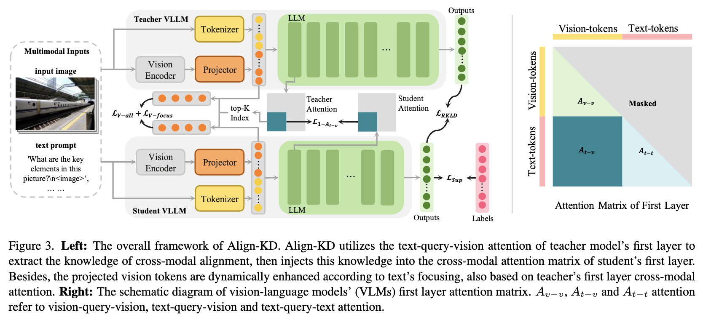
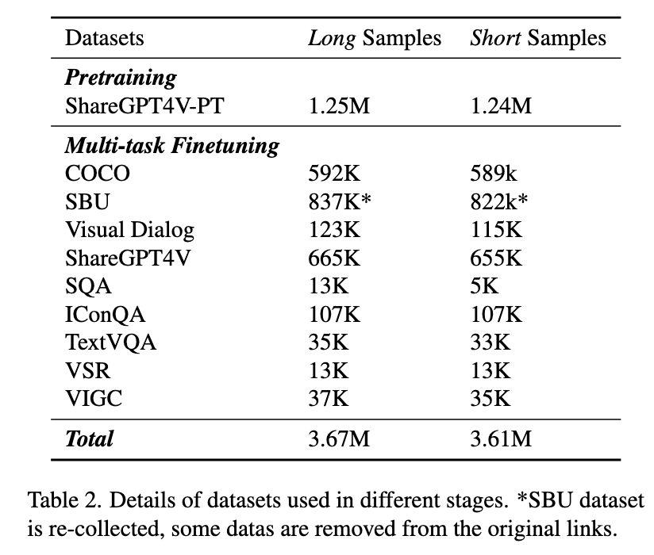
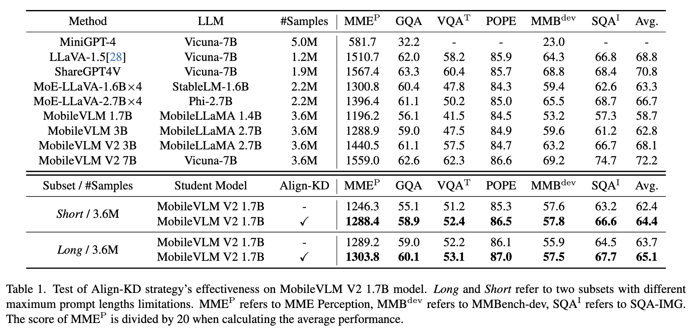
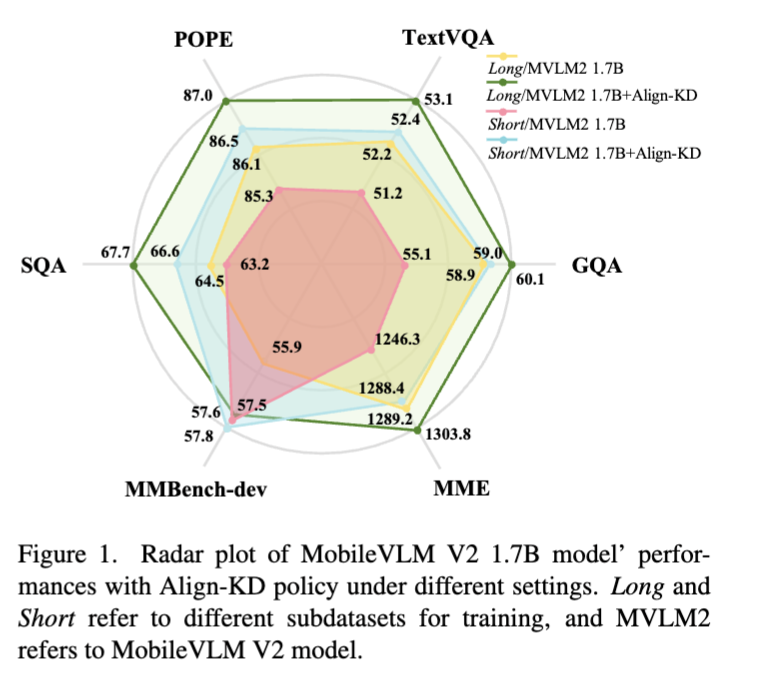

# 2025-CVPR-Align-KD- Distilling Cross-Modal Alignment Knowledge for Mobile VLM

代码链接：https://github.com/fqhank/Align-KD

这篇论文提出了一种名为Align-KD的知识蒸馏方法，旨在提升移动端视觉语言模型的性能。当前的VLM通常结构庞大，难以在移动设备上高效部署，**而现有的蒸馏方法多数忽视了视觉与语言两种模态之间关键的跨模态对齐知识**。Align-KD通过指导较小的学生模型学习大模型教师**在浅层Transformer中的跨模态匹配及视觉token到文本嵌入空间的投影方式**，有效强化了学生模型的跨模态对齐能力。

具体来说，**论文发现VLM中的第1层和最后1层Transformer层对特征变化最大，且跨模态对齐主要发生在浅层**，因此Align-KD只蒸馏第1层中“文本查询视觉”注意力矩阵部分，利用均方误差损失引导学生模型模仿教师模型的注意力分布。**此外，Align-KD还根据教师模型的注意力，动态增强学生模型的视觉token，使其针对不同文本提示中的关注焦点进行调整**，同时结合反向Kullback-Leibler散度损失，促进学生模型输出更接近教师模型的预测分布。

实验中，Align-KD在使用MobileVLM V2 7B作为教师模型的基础上，成功提升了MobileVLM V2 1.7B学生模型在六个不同视觉语言基准测试中的平均成绩约2.0分，且在资源受限的训练场景下仍表现良好。论文还进行了消融实验，验证了各个设计组件的有效性和重要性。

总结来看，该工作首次针对移动端VLM提出了重点传授跨模态对齐知识的轻量级蒸馏策略，保证了模型性能提升的同时，对计算资源的需求相对较低，具有推广应用于资源受限设备的潜力，促进了高级视觉语言理解能力在移动端的实用化发展.

## 引言

视觉语言模型（Vision Language Model, VLM）是一项重要的多模态技术，它搭建了视觉和文本数据之间的桥梁，促进了许多现实世界任务和应用的发展。基于大型语言模型（Large Language Models, LLMs）的成功，已有工作尝试将视觉模态特征与LLMs结合，以扩展模型的能力及其应用潜力，构建新的视觉语言模型（VLMs）。然而，随着输入特征变得更加复杂，VLM的结构也变得更深更重，因为它们必须处理来自不同模态的信息，并应对更多样的场景。VLM的规模和复杂度不断增加，使其难以在服务器或高速互联网之外使用，这限制了这些尖端人工智能在不同场景下的发展，尤其是在离线设备如手机和机器人，或某些保密应用设备上的部署。

目前，越来越多的关注集中在压缩VLM模型的同时尽可能保持其强大的能力。MobileVLM系列模型是首批能够在移动设备上运行的VLM，MobileVLM V1和MobileVLM V2均属于此类模型。该论文介绍了Align-KD，**一种轻量级的知识蒸馏方法，旨在提升移动端视觉语言模型（MobileVLMs）的性能。**MobileVLM V2 1.7B模型通过设计轻量级的视觉下采样投影器，**将视觉token映射到文本嵌入维度，并采用新颖的训练策略，表现优于许多7B参数规模的视觉语言模型。然而，继续缩小模型规模将面临更大的性能下降风险，因此需要新的策略来支持移动端VLM的发展。**

与直接缩减模型规模带来显著性能损失不同，作者希望在不增加数据量的情况下提升模型能力。知识蒸馏（KD）方法广泛用于增强神经网络，主要通过更强大的教师模型指导较小的学生模型，学习教师的行为或隐藏表征。**以往针对大型模型的知识蒸馏多聚焦于单一NLP模态，而视觉语言多模态模型方面的研究大多停留在大模型出现之前，集中于对前端视觉提议的对齐，这些方法已不再适合当前的VLM技术。**一些方法在所有Transformer层之间使用均方误差损失，**但这对于层数更多且结构差异大的VLM而言并不合适。**

论文指出，**视觉与文本输入的对齐是VLM中最关键的部分**，但该关键跨模态对齐知识迄今未被蒸馏利用。跨模态特征对齐不佳会导致理解和推理困难。基于此，作者提出Align-KD方法，使1.7B参数的学生模型能够从更强大的教师模型中学习对齐知识。**通过实验证明，VLM的第一层和最后一层Transformer对特征变化影响最大，类似于大型语言模型的趋势，表明跨模态对齐主要发生在浅层，输入嵌入被映射到高维空间用于理解和推理。利用注意力机制的跨模态查询特性，学生模型模仿教师模型第一层的文本查询视觉注意力分布。此外，考虑到视觉token的重要性因文本提示不同而异，方法将教师模型中有价值的视觉嵌入以非均衡方式注入学生的视觉投影输出。最后，结合最新的大型语言模型研究，计算预测输出之间的反向Kullback-Leibler散度（R-KLD），促进学生模型以更通用的均值寻求方式学习。**

Align-KD方法应用于从MobileVLM V2 7B教师模型对MobileVLM V2 1.7B学生模型进行蒸馏，同时构建了两种不同最大提示长度限制的子数据集，以测试Align-KD在资源受限场景下的效果。依托MobileVLM V2的多步骤训练策略，Align-KD显著提升了学生模型在6个不同基准上的表现，显示了其在有限计算资源下助力移动端VLM发展的巨大潜力。

主要贡献如下：

- 提出Align-KD，首个针对移动端VLM跨模态对齐关键知识进行蒸馏的方法；
- Align-KD帮助MobileVLM V2 1.7B模型在不同设置和基准上稳定提升，促进了VLM在边缘设备的应用；
- Align-KD不依赖于特定的VLM设计，仅需轻量训练设计，适合扩展到各种资源受限场景。

## 相关工作

### 2.1 大型模型及其趋势

近年来，像GPT-3、OPT和LLaMA这样的超大型语言模型（LLMs）显著突破了深度学习及其应用的边界。ChatGPT引发了一股新潮流，并激励了诸如Vicuna等后续工作。此外，一些研究尝试将多模态知识引入大型模型。LLaVA通过将视觉token输入到LLM中，实现视觉和文本内容之间的综合推理，其他许多工作也致力于视觉和文本理解之间的平衡。然而，LLM规模的不断扩大导致对计算资源的高需求，限制了它们的应用。TinyLLaMA和MobileLLaMA通过缩减架构规模，同时保持了相对不错的性能。与此同时，在视觉语言模型领域，MobileVLM系列是首个支持移动设备上运行的开源视觉语言模型。除了针对大型模型的训练策略和特殊架构的开发之外，量化和剪枝等模型压缩技术也蓬勃发展，为减轻计算资源负担提供了解决方案。借助这些方法，LLMs能够实现更快、更轻量的推理，同时几乎不损失准确率.

### 2.2 大型语言模型蒸馏

此前的技术主要致力于模型的缩减，而知识蒸馏（Knowledge Distillation, KD）技术则致力于模型能力的提升。在知识蒸馏中，较弱的学生模型试图从较强的教师模型学习不同方面的知识，例如输出或隐藏表示。MiniLLM研究了输出分布上的Kullback-Leibler散度损失，提出反向KLD相比正向KLD更能帮助学生模型在均值寻求方面的学习。一些研究者关注隐藏特征，训练任务感知滤波器，在不同中间层向学生模型蒸馏知识。**教师模型还可用于为学生模型创造更合适的数据环境，尤其在大型语言模型背景下，数据往往多样且有时含有噪声。**Hsieh等人设计了逐步蒸馏策略，利用教师模型的推理能力为学生模型提供训练数据，从而在数据中注入标签噪声和文本推理。Meta深入黑盒系统，通过蒸馏系统技术（如链式思维、改写和回应等）生成的高质量输出，反哺标准大型语言模型的生成过程.

### 2.3 视觉语言模型的蒸馏

大多数视觉语言模型的蒸馏方法设计于大型模型时代之前。考虑到传统VLM依赖视觉提议，Fang等人提出对教师模型和学生模型的输入提议进行对齐，并使后续的Transformer模块对齐它们的注意力分布。为了压缩VLM，Wang等人结合剪枝与蒸馏，进行简单的输出logits模仿以及对注意力和隐藏状态的蒸馏。虽然这些工作提供了对VLM蒸馏的思考，但它们局限于视觉语言模型之外的领域，**而VLM通常包含更多的Transformer层以及更复杂的视觉和语言模态间的对齐。**在VLM-KD中，研究人员使用类似LLaVA-NeXT的VLM生成文本提示，并利用对比学习来提升视觉模型的长尾识别能力。LLaVA-MoD通过最小化输出分布之间的Kullback-Leibler散度并利用直接偏好优化来增强小型多模态语言模型区分高质量与低质量样本的能力。但LLaVA-MoD依赖于将稀疏专家混合架构集成到语言模型中，**忽略了蒸馏中对齐知识的缺失**，这为进一步探索留下了广阔空间。

## Align-KD

在视觉语言模型中，视觉嵌入和文本嵌入构成了大型模型的输入。然而，显然这两种模态的嵌入机制存在差异，这意味着嵌入必须经过特征空间中的跨模态对齐。跨模态对齐能力对于VLM至关重要，**但以往的工作主要集中在单模态大型语言模型的蒸馏，忽视了对学生模型教授对齐知识的重要性。**在这里，我们首先探讨VLM中的跨模态对齐，然后基于MobileVLM系列逐步提出我们的Align-KD方法。

### 3.1 对齐发生在哪里？

大多数视觉语言模型，例如MobileVLM[7, 9]，设计了特殊的视觉投影器来投影视觉嵌入，但这一操作主要是对嵌入的维度进行对齐。将视觉和文本嵌入对齐到相同的高维空间几乎是一个黑盒系统。

Sun等人[40]尝试揭示LLM中Transformer层的内部工作机制。研究人员对LLaMA 2的7B、13B和70B模型[42]的每一层Transformer都进行了跳过和切换操作，**发现第一层和最后一层的变化会导致性能最大幅度的下降，而中间层的波动则较小。**此外，**参数中间层的权重相似度较高，而第一层和最后一层则明显不同。研究人员得出结论，第一层和最后一层非常重要，承担着特殊职责。**

这给我们启发，探究VLM中LLM的第一层和最后一层是否具有类似的功能，将输入嵌入映射进出特征交汇的高维空间。如果是这样，那么两种模态的对齐也应当同时发生在这里。

> 总结来看，图2说明了MobileVLM V2模型中Transformer的第一层和最后一层负责对特征进行重要的转换和映射，承担从输入的低维或分离模态空间投影到统一高维空间以及最终输出层的映射。而中间层主要负责特征的逐步融合与稳定，变化平缓。这一发现支持了模型设计中重视浅层和末层的跨模态对齐和转换的思路，有助于提升模型性能和跨模态理解能力.
>
> 1. 图2(a)：相邻层特征的余弦相似度
>
> - 计算模型每两个相邻层之间的特征余弦相似度。
> - 结果显示中间层的特征相似度较高，接近0.8-0.9，说明中间层特征变化较小且平稳。
> - 相比之下，第一层和最后一层的相似度明显较低，约在0.3-0.5之间，表明特征变化较大。
>
> 2. 图2(b)：同一层内视觉和文本嵌入位置特征的余弦相似度
>
> - 比较每层中视觉token和文本token的特征余弦相似度，展示跨模态特征对齐情况。
> - 使用对数坐标展示，以突出变化趋势。
> - 观察到第一层和最后一层的视觉与文本特征相似度最低，说明开始和结束层的跨模态对齐差异较大，跨模态特征融合过程显著。
> - 中间层视觉与文本特征相似度较高，表明特征在这部分层次较为融合和稳定。
>
> 3. 图2(c)：同一层内视觉和文本嵌入位置特征的归一化欧氏距离
>
> - 测量每层视觉token与文本token特征的欧氏距离，量化两模态特征间的差异大小。
> - 结果显示第一层和最后一层距离最大（约1.2-1.6），说明两端层的跨模态特征差异显著。
> - 中间层距离较小（约0.2-0.4），指示中间层跨模态融合程度较高。

基于不同规模的已训练MobileVLM V2模型，我们进行了三个简单实验，探索不同Transformer层的特征变化趋势。首先，我们计算了每两个相邻层特征（包括输入特征）的余弦相似度。**如图2(a)所示，中间层的相似度远高于第一层和最后一层，暗示这两层的特征空间变化剧烈。**然后，我们定位输入嵌入中的视觉token和文本token位置，计算这两个部分在每层内的特征余弦相似度及欧氏距离，结果见图2(b)和图2(c)。实验结果进一步证实我们的猜想：**LLM的头层将输入映射到高维空间进行深度处理，最后一层将其映射到输出空间。这意味着第一层也负责将来自不同领域的文本和视觉嵌入映射到同一高维空间，即完成对齐。**

> 第一层和最后一层就像是模型的"入口"和"出口"，负责最关键的特征转换和语义提炼过程。它们不仅仅是普通的转换层，而是模型能力的关键枢纽。
>
> - 第一层：负责将输入嵌入映射到高维特征空间
>   - 将不同模态（如视觉和文本）的输入转换到一个统一的高维表征空间
>   - 完成跨模态对齐的关键步骤
> - 最后一层：负责将混合后的深度特征映射到输出空间
>   - 将经过多层处理的复杂特征转换为最终的语义表征
>   - 完成信息的最终提炼和压缩
>
> 1. 特征变化的显著性，研究发现:
>
> - 中间层特征相似度高，变化平缓
> - 第一层和最后一层特征变化最为剧烈，表明它们承担着关键的转换功能
>
> 2. 对齐与投影机制，第一层的特殊性体现在：
>
> - 实现不同模态输入的维度对齐
> - 将原始输入投影到适合深度处理的高维空间
> - 为后续层提供统一的特征表征基础
>
> 3. 计算原理
>
> - 第一层：通过注意力机制（如文本-查询-视觉注意力）实现跨模态token的初始感知
> - 最后一层：整合全局信息，生成最终的语义输出

值得注意的是，MobileVLM V2的1.7B和3B模型中的LLM均来自MobileLLaMA家族，7B模型中的LLM为Vicuna-7B[51]，因此结果并非结构相关。

除了LLM的第一层之外，像MobileVLM这类模型还设计了视觉投影器对视觉嵌入进行下采样以减少计算。投影器学习保持和增强重要信息，并从维度上将视觉嵌入与文本嵌入对齐，同时也通过下游LLM的反向梯度指导学习基本的跨模态知识。

基于上述讨论，我们提出从VLM的两个方面蒸馏跨模态对齐知识：VLM中LLM的第一层，以及视觉投影器的输出嵌入，如图3左侧所示。

### 3.2. 第一层文本查询-视觉注意力（Text-Query-Vision Attention）

视觉语言模型中大语言模型的第一层是跨模态对齐发生的重要位置，如上文所述。几乎所有近期的大语言模型都基于Transformer架构构建，Transformer是一种高效的并行注意力结构。虽然有些工作尝试改进Transformer模块，但其基本的注意力机制依旧是：将输入特征投影为查询（Q）、键（K）和值（V），然后利用它们生成注意力值，以帮助不同特征token之间的自适应融合。

注意力值反映了token对其他token不均衡的关注程度，并决定了输入特征将如何被投影。这种注意力机制的本质使其成为跨模态对齐在VLM中信息传递的完美载体。VLM的注意力矩阵通常呈现如图3右侧所示的样式，输入嵌入是由视觉token和文本token拼接而成的。由于VLM主要采用解码器Transformer层，注意力矩阵是一个下三角矩阵且一半被遮掩。矩阵下部包含三个部分：视觉查询-视觉注意力（$ A_{v−v} $）、文本查询-视觉注意力$（A_{t−v}）$和文本查询-文本注意力$（A_{t−v}）$。

以前的知识蒸馏方法通常教学生模型学习教师不同层的所有注意力值。相反，我们提出让学生模型仅模仿第一层的文本-查询-视觉注意力 $ A_{1,t−v} $。给定一个有知识的教师模型 $ T $，我们从其第一层中提取其注意力矩阵 $ A_T^1 $，然后分离出文本-查询-视觉部分以形成 $ A_T^{1,t−v} $，并对学生 $ S $ 的第一层文本-查询-视觉注意力 $ A_S^{1,t−v} $ 做同样的操作。然后，我们应用一个 $ 1 \times 1 $ 卷积投影器 $ P_{attn} $ 来对齐这两者的维度，然后使用一个简单的均方误差 (MSE) 损失来获得第一层 $ A_{1,t−v} $ 的 only KD 损失：

$$
L_{A_{1,t−v}} = MSE(P_{attn}(A_T^{1,t−v}), A_S^{1,t−v}) \tag{1}
$$

这种第一层 $ A_{1,t−v} $ only KD 具有以下几个优点：

1. 首先，由于交叉注意力机制，第一层的文本-查询-视觉注意力矩阵自然地暗示了两种模态的输入 tokens 如何相互感知，以及 tokens 将要采用的对齐投影方案以投影到更对齐的特征空间中。相反，当 VLMs 的文本 tokenizer 通常是固定的时，很难从 $ A_{1,t−t} $ 中提取有用的知识，而蒸馏 $ A_{1,v−v} $ 只会导致更多的 vision-only 增强，这已经被前面的视觉投影器所加强。而且它们都缺乏关键的跨模态知识。
2. 其次，第一层 $ A_{1,t−v} $ only KD 显著减少了计算工作量，使整个方法高效。一些工作蒸馏了多个层的注意力矩阵，其中一些甚至设计了特殊的下游任务来帮助学生学习，这可能会导致过度的计算压力。即使在第一个注意力矩阵中，与完全蒸馏相比，第一层 $ A_{1,t−v} $ only KD 也节省了高达 50% 的计算量。这种轻量级设计使得有可能在计算资源有限的情况下进行训练。
3. 此外，考虑到不同 VLMs 的设计在模型深度和块细节上可能不同，第一层 $ A_{1,t−v} $ only KD 表现出更大的灵活性，并且可以轻松迁移到不同的模型，而不管其特定的结构设计或不同深度 Transformer 层的含义如何。

### 3.3 基于文本聚焦的视觉增强

生成输入视觉 tokens 的视觉投影器还承担了进行基本跨模态对齐的责任。例如，MobileVLM 模型中的 LDP 在提取细节和语义特征时会对嵌入进行下采样，并将嵌入投影为与文本嵌入相同维度的更少的 tokens。这种粗略的对齐缺乏对文本模态信息的感知，仅接收来自下游 Transformer 层的交叉注意力的反向梯度，以与另一种模态进行接触。

为了改善这一不足，我们建议利用交叉模态注意力来帮助投影器获得更多的交叉模态信息曝光。尽管视觉 tokens 已经通过投影器进行了优化，但由于文本提示的方向性指示，文本对不同视觉 tokens 的注意力仍然相对稀疏。$ A_{1,t−v} $ 不仅包含有关交叉模态对齐投影的信息，还揭示了文本提示最关注哪些视觉 tokens。不同的提示可能会关注不同的嵌入，但一些 tokens 可能会被显著地忽视。我们并不是抑制暂时不受欢迎的视觉 tokens 的学习，而是建议根据教师模型的 $ A_{1,t−v} $ 在当前基础上增强最受欢迎的 tokens，避免影响其他 tokens 的学习。

**通过获取教师模型第一层的文本-查询-视觉注意力，我们将注意力值 $ A_{T}^{1,t−v} $ 沿着文本维度相加，以获得视觉 token $ n $ 的注意力得分 $ Score_n $，其公式为**：
$$
Score_n = \sum_{m \in M} A_{T}^{1,t−v,(n,m)} \tag{2} 
$$

其中 $ M $ 是文本 tokens 的数量。接下来，我们将得分最高的 tokens 的索引（即 $ IdxK $）排序出来。最后，我们对 $ IdxK $ 中列出的视觉 tokens 进行知识注入，从教师模型到学生模型：

$$
L_{V−focus} = MSE(P_V(Emb_T^{IdxK}), Emb_S^{IdxK}) \tag{3}
$$

其中 $ Emb_T^{IdxK} $ 和 $ Emb_S^{IdxK} $ 分别是教师和学生在 $ IdxK $ 范围内的视觉 token 嵌入，而 $ P_V $ 是一个 $ 1 \times 1 $ 的卷积投影器。

> 具体做法是计算文本提示对每个视觉 token 的注意力得分，并找出得分最高的 tokens。然后，根据这些高得分的视觉 tokens，实施知识注入，即将教师模型的知识传递给学生模型

除了对当前热门 tokens 的知识注入外，其余部分也不应被忽视。当前文本提示的低排名注意力并不意味着在其他场景下的稳定低人气。对视觉 tokens 的关注可能会发生剧烈变化，例如，当从“书封面上的作者名字是什么？”变为“书下的桌子是什么颜色？”时。视觉 tokens 的关注可能会剧烈变化，例如，当提示从“书封面上作者的名字是什么？”转变为“书下的桌子是什么颜色？”时。此外，教师的视觉 token 通常包含更强的知识，因为它受到更强大的 LLM 的指导，并且在大多数情况下具有更高的维度。在这种情况下，我们对所有视觉 tokens 进行通用知识蒸馏，即：
$$
L_{V−all} = MSE(P_V(Emb_T), Emb_S) \tag{4}
$$
这可以防止对其他 tokens 的有害抑制。我们将两个损失结合起来，使用权重 λ 形成基于文本聚焦的视觉 token 增强损失：
$$
L_V = L_{V−all} + \lambda L_{V−focus} \tag{5}
$$

### 3.4. 整体知识蒸馏策略
 除了在 VLM 前端进行对齐蒸馏外，我们还遵循 MiniLLM 增加反向 Kullback-Leibler 散度（RKLD）损失，该损失将学生模型的预测分布作为目标，用于学生和教师之间的输出。由于文本提示和输入图像各不相同，RKLD 损失比前向 Kullback-Leibler 散度（FKLD）更适合 VLM 学习均值寻求而非模式寻求，从而防止在特定场景中过拟合。从教师和学生提取输出预测分布 $ p_T, p_S $，反向 Kullback-Leibler 散度损失可以表示为：
$$
L_{RKLD} = p_S \log \frac{p_S}{p_T} \tag{6}
$$
对齐损失和 RKLD 损失与原始监督损失 $ L_{Sup} $ 一起工作，我们的整体 Align-KD 损失在学生模型上可以表示为：
$$
L = L_{Sup} + L_{A1,t−v} + L_{V} + L_{RKLD} \tag{7}
$$

## 4.实验

###  4.1. 基本实验设置

MobileVLM系列 是面向移动设备最新的、最前沿的视觉-语言模型。MobileVLM V2 1.7B模型以其小型模型设计展现了卓越的性能。考虑到进一步压缩视觉编码器或LLM的局限性，我们建议在MobileVLM V2 1.7B模型上应用Align-KD，以帮助在边缘设备上获得更好的性能。我们选择MobileVLM V2 7B模型（经过良好训练并提供）作为教师模型来进行知识蒸馏。Align-KD作为一种额外的策略，与通用的学生训练方法协同工作。

我们使用8个NVIDIA V100 GPU来进行蒸馏训练。我们遵循MobileVLM V2的工作，将训练阶段分为预训练和多任务微调。由于内存空间有限，我们使用梯度累积来实现预训练阶段的全局批大小为256，多任务微调阶段的全局批大小为128。在这两个阶段，我们都使用deepspeed的ZeRO2策略 ，并在半精度浮点下运行所有实验。

我们遵循MobileVLM V2，在训练时冻结视觉编码器和分词器，只训练网络的其余部分。在预训练期间，投影仪和其他组件的最大学习率分别设置为1e-3和2e-5，在多任务微调期间设置为4e-5，使用余弦调度。用于维度对齐的卷积投影仪是随机初始化的，并一起训练。视觉token损失LV中的权重λ设置为0.1，以适应token被关注的不稳定变化。对于基于文本焦点（text-focus-based）的视觉token知识蒸馏中的top-K选择，我们选择具有最高注意力得分的前16个token。我们遵循原始MobileVLM V2工作中其余的设置。

### 4.2. 数据和数据集重构

Align-KD 遵循 MobileVLM V2 在各种数据集上进行训练。在预训练阶段，使用 ShareGPT4V-PT 来为学生提供视觉和文本的简要知识。它是一个 caption 数据集，包含 120 万个图像-文本对。在多任务训练阶段，提供来自不同任务（如对话和 VQA）的更多数据：COCO、SBU、**Visual Dialog**、ShareGPT4V、SQA、IConQA、TextVQA、VSR、VIGC。请注意，SBU 是一个重新收集的数据集，并且会不时更新，因此某些原始数据可能已被删除。在这种情况下，我们清洗了数据集中的数据列表，这与原始 MobileVLM 训练不同。为了评估我们的 Align-KD 方法的有效性，我们测试了在不同基准上的性能，包括 GQA、SQA、TextVQA、MME、MMBench 和 POPE。

虽然移动 VLM 被设计用于资源有限的移动设备部署，但当计算资源不足时，VLM 的训练也面临挑战。当输入文本提示太长时，计算工作量可能非常高，有时会导致训练期间出现“内存不足”错误。我们基于上面列出的原始数据制定了两个不同的子数据集，每个子数据集都包含具有不同最大提示长度的数据：Short，最大长度为 512 个嵌入 token；Long，最大长度为 2048。考虑到训练数据包含许多视觉问题回答 (VQA) 任务，我们删除了过长的数据而不是截断它们，从而使两个子集在数据量上也有所不同。此设置与原始 MobileVLM 工作不同，但可以帮助检查在不同资源受限场景下 Align-KD 策略的有效性，并且还有助于扩展 VLM 的应用场景。子集详细信息如表 2 所示。

### 4.3. Align-KD 的有效性

在制定我们的长短子数据集后，我们使用这些数据集来训练 MobileVLM V2 1.7B 模型，并采用了提议的 Align-KD 策略。注意，我们使用了由 MobileVLM 工作提供的全面训练和开源的 MobileVLM V2 7B 模型作为我们的知识蒸馏教师。表 1 显示了在 6 个不同基准和两个子集上的结果。使用长数据集训练时，MobileVLM V2 1.7B 模型的平均得分为 63.7。当使用 Align-KD 策略训练时，学生模型在所有基准上都获得了普遍的提高，平均得分达到了 65.1。更具体来说，Align-KD 帮助 MobileVLM V2 1.7B 模型在 SQA 基准上获得了 3.2 的提升，在 MMBench 上获得了 1.6 的提升。在资源有限的场景下，Align-KD 为 MobileVLM V2 1.7B 模型在所有基准上提供了更好的平均提升，从 62.4 增加到 64.4。在 GQA 上，Align-KD 提高了 3.8。此外，它在 POPE 这一具有挑战性的幻觉测试基准上也带来了 1.2 的显著提升。

综合结果见图 1 的雷达图。我们的 Align-KD 在不同的视觉-语言任务中带来了稳定和良好的提升。此外，当学生模型因缺少长提示而出现性能下降时，Align-KD 成功地将知识注入模型，使得蒸馏后的学生模型在性能上可与使用长文本训练的模型相媲美。

### 4.3 消融试验

我们更进一步进行了消融研究，以验证Align-KD中每种方法的有效性。为了公平起见，我们对Short子数据集进行了所有的消融实验，结果如表3所示。反向 Kullback-Leibler 散度(RKLD)损失有助于学生模型学习模仿更强大的教师模型的输出，但会带来某种程度上偏差的改进。相反，仅应用第一层 A1,t−v 损失可带来显著且更平衡的提升，平均达到 63.6。聚焦的和所有视觉 tokens 的结合进一步将性能平均提高了 0.8。

在跨模态对齐学习期间，我们仅对第一层注意力的文本-查询-视觉部分应用知识蒸馏。我们通过与其他方法进行比较，进一步验证了这种设计的合理性，结果如表 4 显示，用视觉-查询-视觉注意力蒸馏取代第一层 A1,t−v only KD 策略会导致性能急剧下降。我们认为这是因为视觉 tokens 的自注意力不利于初始跨模态对齐，并可能导致注意力嵌入中非常不稳定的波动。然而，改变为文本-查询-文本注意力明显优于视觉-查询-视觉训练，仅略微下降了 64.4 到 63.2。我们认为这种现象可归因于训练时固定的文本 tokenizer，这导致了跨模态注意力投影的间接稳定学习。此外，学习完整注意力比仅学习 A1,v−v 和 A1,t−t 表现更好，这进一步证实了我们之前的推测：跨模态 A1,t−v 是最重要的因素，而学习 A1,t−t 有助于减轻 A1,v−v 蒸馏带来的负面影响。

在图 2 中，我们检查了 VLM 中特征如何变化，并表明第一层和最后一层是最突出的特征。在我们的 Align-KD 中，我们主要关注第一层，因为它最多地暴露于需要对齐的输入，而最后一层主要负责将表示投影到输出空间中。然而，我们也测试了学生在了解输出注意力的情况下的表现。如表 4 的最后一行所示，在 Align-KD 中添加最后一层注意力的蒸馏后，学生模型的性能下降。对此的一种可能的解释是，深层特征已经充分混合和提取，并且与 RKLD 在输出上的功能存在一些重叠。此外，对额外注意力进行蒸馏会导致计算量显着增加，这对于资源受限的场景来说是一个负担，而我们的 Align-KD 中的第一层 A1,t−v only KD 在有效性和效率方面都表现出巨大的优势。

### 4.5 讨论和局限性

在长提示和短提示限制下，我们的 Align-KD 策略都能为 MobileVLM V2 1.7B 模型带来益处。我们的 Align-KD 采用相对轻量化的设计，这使得它有可能扩展到资源受限的场景中。在此，我们在表 5 中提供了 Align-KD 的工作开销比较，包括总训练时间和训练期间占用的最大内存。

实验是在 8 个 Nvidia V100 GPU 上进行的。在 Short 和 Long 子数据集上训练 Align-KD MVLM2 1.7B 分别需要大约 296 GPU 小时和 676 GPU 小时。对于一些由于梯度累积而导致瞬时过载的示例，我们保存来自教师模型的输出表示，并在我们能够从设备中移除教师模型后，让它们稍后加入训练。在处理 Short 子数据集时，Align-KD 可以实现最大内存工作负载为每个 GPU 22.3 GB 的训练，这对于像 NVIDIA 3090 这样的商业设备来说是可以接受的。至于 Long 子数据集，每个 GPU 30.7 GB 的工作负载对于像 NVIDIA V100 这样的设备来说也是可以接受的。由于 vanilla MobileVLM V2 1.7B 的内存负载可以灵活调整，因此这里没有给出。尽管带来了额外的工作负载，Align-KD 仍然能够在不同的视觉语言任务中实现普遍的改进。

## 5．结论

注意到过去的 VLM 蒸馏工作忽略了多模态对齐知识，我们为 MobileVLM V2 模型提出了一种知识蒸馏方法，即 Align-KD。基于对齐主要发生在 VLM 中 LLM 的前层的推测，Align-KD 建议仅对第一注意力的文本-查询-视觉部分进行知识蒸馏。此外，视觉 tokens 根据文本 tokens 的关注不平衡地增强。使用 MobileVLM V2 7B 模型作为教师，Align-KD 能够在常规训练设置和模拟的资源受限设置下，在 6 个基准测试中实现通用改进。
