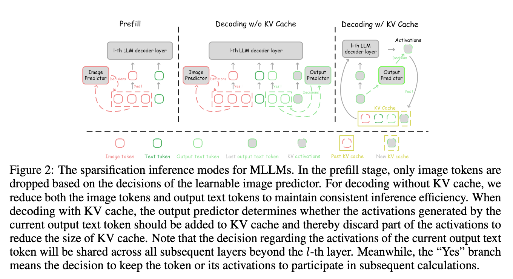
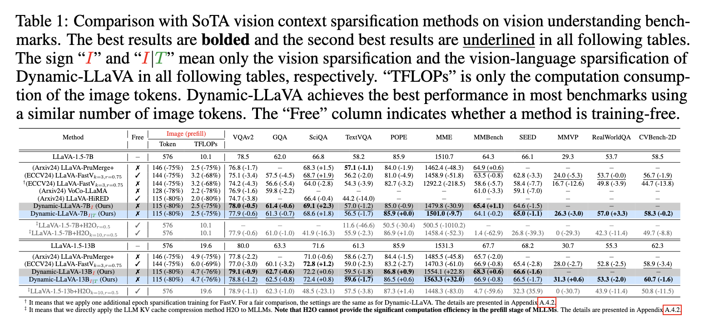
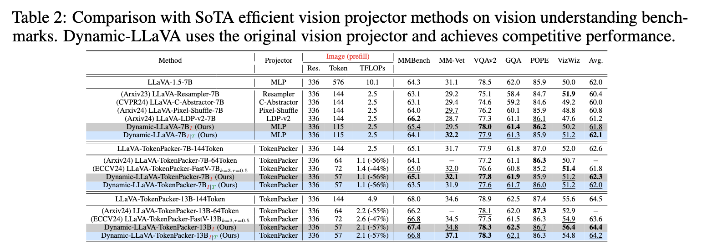
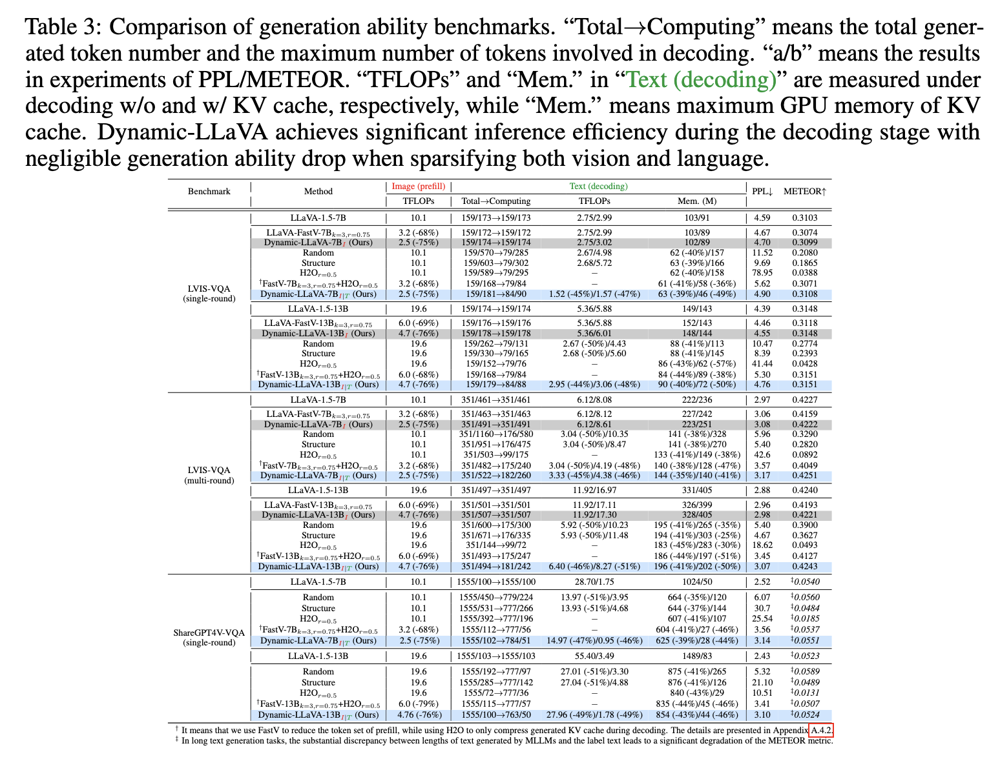

# 2025-ICLR-Dynamic-LLaVA- Efficient Multimodal Large Language Models via Dynamic Vision-Language Context Sparsification

## 背景

- 多模态大型语言模型虽然在视觉理解、推理和交互方面表现出色，但其推理阶段随着输出文本令牌数量增加，计算和内存消耗也呈递增趋势，尤其是在解码阶段。这种增长严重影响了MLLMs的推理效率。
- 现有的高效推理方法主要集中在预填充阶段减少视觉信息冗余，如减少图像令牌，但这种预填充阶段的效率提升会随着解码过程的进行而逐渐减弱，因为解码阶段的计算瓶颈逐渐转向了自回归生成的语言令牌。
- 传统的KV缓存压缩方法虽然在一定程度上减轻了GPU内存压力，但通常依赖历史KV缓存的选择，且无法同时提升预填充和无KV缓存解码阶段的效率，对多模态场景适应性差。

> 该图显示，尽管视觉令牌的稀疏化在预填充阶段能显著节省资源，但随着更多输出文本令牌的生成，计算和内存开销仍然逐渐增加，且传统方法在解码阶段的效率优势减少。这一现象说明了仅仅减少图像令牌数量不能持续提升解码阶段的推理效率

## 目的

- 提出Dynamic-LLaVA，一个动态视听语言上下文稀疏化框架，旨在通过对视觉上下文和语言上下文的动态稀疏化，提升MLLMs在推理全过程中的计算和内存效率。
- 在预填充和解码阶段分别设计适配不同推理模式（预填充、无KV缓存解码、有KV缓存解码）的稀疏化策略，实现对视觉和语言令牌的动态选择和过滤，持续减少计算量和内存占用。
- 通过端到端训练使模型能够动态学习并调整保留的重要令牌，从而在保证理解和生成能力的前提下，大幅度降低资源消耗。
- 实验中，Dynamic-LLaVA能在预填充阶段减少约75%的计算，在解码阶段减少约50%的计算和GPU内存使用，同时维持甚至提升模型性能，具备实际应用潜力。

## 相关工作

### 2.1 令牌数量减少以提升MLLM效率

这一部分主要讨论了针对视觉令牌的稀疏化和高效视觉编码/投影器设计方法，这些方法试图通过减少输入给大语言模型的图像令牌数量，从而加速推理预填充阶段。

- **视觉上下文稀疏化**：如FastV等方法利用注意力矩阵筛选关键图像令牌，仅将部分视觉令牌输入LLM，极大减少图像令牌数。
- **高效视觉编码器/投影器**：通过改进视觉特征提取和投影过程，生成更少的视觉令牌。

尽管这类方法在预填充阶段取得了显著的效率提升，但文中指出随着生成过程进入解码阶段，效率优势逐渐减弱，因为解码阶段的主要计算瓶颈转向了自回归生成的文本令牌，视觉令牌减少对解码效率提升作用有限。作者的Dynamic-LLaVA框架通过同时动态稀疏视觉和语言上下文，实现了推理全过程（含预填充及解码阶段）的持续高效推理，突破了传统方法的不足。

### 2.2 LLM的KV缓存压缩以节省内存

- 传统方法依赖历史已生成的KV缓存子集，通过计算当前查询和历史缓存的注意力分数来选出关键激活，剔除低效KV缓存。
- Dynamic-LLaVA提出通过"在线KV缓存压缩"策略，**即基于当前输出文本令牌的特征决定是否保留该令牌对应的KV激活，无需依赖历史KV缓存。**这种策略使Dynamic-LLaVA不仅能在含KV缓存的解码阶段提升效率，也能在预填充和无KV缓存解码阶段实现计算和内存节省，这是传统KV缓存压缩方法无法做到的。

此外，Dynamic-LLaVA设计了专门针对不同推理模式，如预填充、解码含/不含KV缓存的稀疏化推理方案，具备更广泛的应用场景和更好的多模态适应性。

第二章在系统梳理了现有的视觉令牌稀疏化和KV缓存压缩技术的基础上，突出Dynamic-LLaVA的创新性——它动态兼顾视觉和语言上下文稀疏化，涵盖推理全过程，并具备在线KV缓存压缩能力，从而显著提升MLLM推理效率和资源利用率，有效解决了传统方法在解码阶段效率减弱的问题，并具备更好的多模态融合适应性.

## 方法

### 3.1 预备知识与符号说明

多模态大型语言模型（MLLM），例如LLaVA（Liu等，2024b），沿用了自回归模型范式（Radford等，2019；Liu等，2024a），其推理通常包含预填充和解码阶段。

在预填充阶段，不同模态的特征被映射到与大型语言模型（LLM）输入嵌入相同的特征分布中。这些多模态特征与文本令牌一起，被LLM同时处理以生成初始输出文本令牌。

而在解码阶段，预填充阶段的令牌连同随后生成的所有输出文本令牌一起，采用自回归方式预测下一个输出文本令牌。

在包含L个Transformer解码层的LLM中，我们定义处理不同类型令牌的索引集合。具体地，预填充阶段图像令牌的索引集合记为 $I_I = {1, 2, \dots, N_I^l}$，预填充文本令牌的索引集合记为 $I_T = {1, 2, \dots, N_T^l}$，而解码阶段输出文本令牌的索引集合记为 $I_{OT} = {1, 2, \dots, N_{OT}^l}$，其中 $N_I^l$、$N_T^l$ 和 $N_{OT}^l$ 分别为第l层解码器中图像令牌、文本令牌和输出文本令牌的数量。

第l层LLM解码器处理的图像令牌、文本令牌和输出文本令牌集合分别记为 $S_I^l = {t_{l,i}^I ,|, \forall i \in I_I}$，$S_T^l = {t_{l,i}^T ,|, \forall i \in I_T}$，以及 $S_{OT}^l = {t_{l,i}^{OT} ,|, \forall i \in I_{OT}}$，其中 $t_{l,i}^I, t_{l,i}^T, t_{l,i}^{OT} \in \mathbb{R}^d$ 表示第l层对应的第i个令牌的向量表示。

所有令牌集合及其大小定义为 $S^l = S_I^l \cup S_T^l \cup S_{OT}^l$，大小为 $N^l = N_I^l + N_T^l + N_{OT}^l$。

> **预填充阶段**：
> 仅对图像令牌进行稀疏化处理。通过一个可学习的图像预测器决定哪些图像令牌可以被丢弃，从而减少后续计算量，提升效率。
>
> **无KV缓存解码阶段**：
> 为了保证推理效率的稳定和一致，模型不仅减少图像令牌，还同时减少输出文本令牌的数量。这样可以平衡输入令牌和已生成令牌的计算负担。
>
> **有KV缓存解码阶段**：
> **通过一个输出预测器判断当前生成的输出文本令牌对应的激活是否需要加入KV缓存**。若决定不加入，则丢弃这部分激活，减小KV缓存的大小，从而节省内存。需要注意的是，对于当前令牌激活的保留或丢弃决策，会被所有后续层共享。此处的"是"分支表示该令牌及其激活将继续参与后续计算。

#### 计算过程

考虑标准LLM的计算过程（Touvron等，2023a），第l层解码器在预填充阶段的计算可描述为：

$$
S_{P}^{l+1} = \text{FFN}(\text{MHA}(S_P^l, S_P^l, S_P^l)),
$$

其中 $S_P^l = S_I^l \cup S_T^l$，$\text{MHA}(\cdot, \cdot, \cdot)$ 表示第l层解码器的多头注意力机制，$\text{FFN}(\cdot)$ 表示前馈网络（Vaswani，2017）。

> 该公式表示先对输入令牌集合 $ S_P^l $ 进行自注意力操作，然后将结果通过前馈网络得到第 $ l+1 $ 层的令牌表示 $ S_P^{l+1} $。这反映了Transformer解码器中每层的核心计算流程，逐层提取和融合多模态特征。
>
> - 记第l层的输入令牌表示集合为 $ S_P^l $，它包含了图像令牌和预填充文本令牌。
> - $ \text{MHA} $ 表示多头注意力机制（Multi-Head Attention），它接受三个参数：查询（Q）、键（K）、值（V），这里都用同一个集合 $ S_P^l $，表示自注意力机制，即令牌之间相互计算关联权重。
> - $ \text{FFN} $ 为前馈神经网络，通常包括两层全连接层和激活函数，用于对注意力输出的特征进行非线性变换和信息融合。

#### 解码阶段

解码阶段一般有两种方式，分别是不使用KV缓存和使用KV缓存的解码方式。

#### 不使用KV缓存的解码

不使用KV缓存的解码可看作预填充阶段的扩展，其计算表示为：

$$
 S_{P}^{l+1} \cup S_{OT}^{l+1} = \text{FFN}(\text{MHA}(S_P^l \cup S_{OT}^l, S_P^l \cup S_{OT}^l, S_P^l \cup S_{OT}^l)).
$$

> 公式中的多头注意力机制 $ \text{MHA} $ 和前馈网络 $ \text{FFN} $ 仍然是核心模块，分别负责捕捉联合令牌间的相互关系和完成非线性变换。
>
> - 令 $ S_P^l $ 表示预填充阶段的图片和文本令牌表示，
> - 令 $ S_{OT}^l $ 表示解码阶段已生成的文本令牌表示，
> - 这里用了集合的并集 $ S_P^l \cup S_{OT}^l $，说明在解码阶段，模型对这两类令牌的联合序列进行处理。
>
> 因此，公式表示模型在第 $ l $ 层，将预填充令牌和解码生成令牌合并后，进行自注意力计算和前馈处理，得到下一层的联合表示，即公式表示形式。这体现了解码阶段对所有上下文令牌（包括视觉输入和已生成文本）进行全面信息融合的过程。

#### 使用KV缓存的解码

使用KV缓存的解码进一步拆解多头注意力操作：

$$
 Q, K, V = {W_{Q}^l S_{OT}^{l, N_{OT}^l}}, {W_{K}^l S_{OT}^{l, N_{OT}^l}}, {W_{V}^l S_{OT}^{l, N_{OT}^l}},
$$

$$
 S_K^l = S_K^l \cup K, \quad S_V^l = S_V^l \cup V,
$$

$$
 O = W_O \text{Attention}(Q, S_K^l, S_V^l),
$$

$$
 S_{OT}^{l+1, N_{OT}^l+1} = \text{FFN}(O),
$$

其中 $W_Q^l, W_K^l, W_V^l, W_O^l$ 是用于生成Q、K、V和输出O的线性层，$\text{Attention}(\cdot, \cdot, \cdot)$ 是缩放点积注意力操作（Vaswani，2017），$S_{OT}^{l, N_{OT}^l}$ 表示第l层解码器中最后一个输出文本令牌，而 $S_K^l, S_V^l$ 是对应的KV缓存。

> 该公式描述了在带有KV缓存的解码过程中，第 $ l $ 层多头注意力（MHA）操作的具体实现细节：
>
> - 首先，将当前解码阶段的最后输出文本令牌集合 $ S_{OT}^{l, N_{OT}^l} $ 通过线性变换获得查询（Q）、键（K）和值（V）三种激活，分别由线性层 $ W_Q^l $、$ W_K^l $、$ W_V^l $ 产生；
> - 接着，将新计算得到的键和值 $ K, V $ 与该层之前缓存的键和值集合 $ S_K^l, S_V^l $ 进行拼接（并集），形成更新后的键缓存 $ S_K^l \cup K $ 和值缓存 $ S_V^l \cup V $，以便在后续步骤中复用，避免重复计算；
> - 使用缩放点积注意力（Scaled Dot-Product Attention）函数，计算 $ Q $ 对缓存键值对 $ S_K^l, S_V^l $ 的注意力输出，记为 $ O $；
> - 最后，将注意力结果 $ O $ 经过输出线性层 $ W_O^l $ 和前馈网络 $ \text{FFN} $，得到第 $ l+1 $ 层的输出令牌集合 $ S_{OT}^{l+1, N_{OT}^{l+1}} $。
>
> 此过程重点在于利用KV缓存机制，累积保存已经计算过的键和值，显著减少重复计算，提高解码推理的效率，特别适合逐步生成文本的多模态大型语言模型。
>
> 通俗来说，这个过程描述的是模型在生成新文字时如何高效利用之前的信息：
>
> - 当模型正在根据已有内容生成下一段话时，它会把刚产生的文字"记住"（用"键"和"值"的信息表示出来），
> - 然后，这些新记住的信息会和之前已经记住的内容合并存起来，就像把新的笔记夹进书中已有的笔记本，形成一个不断扩充的信息库，
> - 接下来，模型用最新产生的"问题"（查询Q）去找书中的相关"答案"（之前存的键和值），通过"注意力"的方法来决定哪些信息更重要，
> - 经过计算后，模型将整合出的信息用来帮助它生成更相关、更连贯的内容。
>
> 这样一来，模型不用每次都重新理解之前所有文字，只需利用已经保存的关键信息，极大地减少了计算量，提高了生成速度和效率。

#### 计算开销与内存分析

预填充阶段和无KV缓存解码阶段的主要计算成本涉及处理不同令牌集合，且大部分开销来自线性层的激活计算。第l层预填充阶段的计算成本与图像和文本令牌数量相关，表达为：

$$
\text{Computation}(\text{Prefill})_l \propto |S_I^l \cup S_T^l|,
$$

无KV缓存解码阶段的计算开销与图像、文本及输出文本令牌数之和相关：

$$
 \text{Computation}(\text{Decoding w/o cache})*l \propto |S_I^l \cup S_T^l \cup S*{OT}^l|.
$$

使用KV缓存的解码只需激活最后一个输出文本令牌，计算开销更低，但需要额外的GPU内存来存储激活状态，内存开销与令牌数量相关：

$$
 \text{Memory}(\text{Decoding w/ cache})*l \propto |S_I^l \cup S_T^l \cup S*{OT}^l|.
$$

减少第l层中图像令牌、文本令牌和输出文本令牌的数量会导致后续层对应令牌数量的减少，从而降低预填充和解码阶段的计算负担和内存开销。

> 强调了KV缓存有效降低了每步解码的计算量，但以增加显存消耗为代价；同时控制令牌数量对整体效率和资源开销有重要影响。
>
> - 在**预填充阶段**，第 $ l $ 层解码器的计算量主要取决于处理的令牌数量，即图像令牌集合 $ S_I^l $ 和文本令牌集合 $ S_T^l $ 的并集大小，计算量与令牌总数成正比。
> - 当在解码阶段不使用KV缓存时，计算量会更大，因为除了图像和文本令牌，还要处理生成的输出文本令牌 $ S_{OT}^l $，因此计算量与三者的总令牌数成正比。
> - **使用KV缓存的解码方式相比不使用缓存的计算量更低**，因为它只需要对最新生成的一个输出令牌进行激活计算，从而显著减少计算开销。
> - **但KV缓存方式的缺点是它需要额外的GPU显存来存储中间激活的中间变量**，即键值对缓存，显存开销仍然与图像、文本及输出令牌集合的总大小成正比。
> - 另外，减少第 $ l $ 层令牌集合大小（无论是图像、文本还是输出令牌）**会使得后续层的令牌规模相应减少**，从而降低这些层的计算量和显存需求，这在预填充和解码阶段都能有效节省资源。

### 3.2 动机

如上所述，令牌数量会影响计算消耗和GPU内存开销，而先前的研究主要致力于减少图像令牌集合 $S_I^l$ 的数量。然而，减少图像令牌数量主要加速了预填充阶段，而在解码阶段的收益逐渐减少。

#### 计算开销分析

预填充阶段通常只计算一次，计算量与视觉令牌和语言令牌数量的并集成正比：

$$ \text{Computation(Prefill)}_l \propto |S_I^l \cup S_T^l| $$

解码阶段的计算消耗和缓存内存开销随着输出文本令牌数量增加而不断上升，约等于输出令牌集合大小：

$$ \text{Computation(Decoding w/o cache)}*l \propto |S_I^l \cup S_T^l \cup S*{OT}^l| \approx |S_{OT}^l| $$

$$ \text{Memory(Decoding w/ cache)}*l \propto |S_I^l \cup S_T^l \cup S*{OT}^l| \approx |S_{OT}^l| $$

其中 $|S_{OT}^l| \to \infty$。

#### 研究动机

**因此，随着解码过程中输出文本令牌的不断生成，计算消耗和GPU内存开销持续增加，而减少图像令牌数量带来的优势在整个生成过程中逐渐减弱。**基于此，我们提出了Dynamic-LLaVA框架，旨在通过对视觉上下文 $S_I^l$ 和语言上下文 $S_{OT}^l$ 共同进行稀疏化，来实现多模态大型语言模型的持续高效运行。

## 3.3 动态视觉-语言上下文稀疏化

### 3.3.1 概述

为了压缩图像令牌集合和输出令牌集合，我们引入了两个二值掩码 $M_I$ 和 $M_{OT}$ 来决定在第 $l$ 个解码器层中哪些令牌应被保留或丢弃，其中 $M_I = \{m_i \mid m_i \in \{0,1\} \wedge \forall i \in I_I\}$，$M_{OT} = \{m_i \mid m_i \in \{0,1\} \wedge \forall i \in I_{OT}\}$。因此，压缩后的图像令牌集合和输出文本令牌集合分别定义为 $S_I^{*l} = \{S_{l,i} \mid M_I^i = 1 \wedge \forall i \in I_I\}$ 和 $S_{OT}^{*l} = \{S_{l,i} \mid M_{OT}^i = 1 \wedge \forall i \in I_{OT}\}$，满足 $|S_I^{*l}| \leq |S_I^l|$ 和 $|S_{OT}^{*l}| \leq |S_{OT}^l|$。通过这种方式，公式4中描述的预填充和解码阶段的计算消耗及GPU内存开销均得到了同步降低。此优化有助于在大型语言模型的整个生成过程中高效利用资源。

具体来说，Dynamic-LLaVA采用两个可学习的预测器 $P_I$ 和 $P_{OT}$ 来分别生成二值掩码 $M_I$ 和 $M_{OT}$。这些可学习的预测器仅在多模态大型语言模型的第 $l$ 个解码层之后被调用一次。也就是说，一旦预测器对令牌做出决策，该决策将被所有后续层共享。这种一次性令牌减少策略避免了对MLLM解码器稀疏率进行复杂调整的需求。实际应用中，我们遵循Chen等人（2024a）的做法，将 $l$ 设为2。关于 $l$ 值的消融实验结果详见表6。值得注意的是，这些可学习预测器由轻量级的多层神经网络组成，仅带来极少的额外计算开销（不足整体计算量的1%）。Dynamic-LLaVA框架的实际GPU延迟和内存使用情况详见表4和表14，详细架构见附录A.4.1。

接下来的章节中，我们将在3.3.2节介绍如何在MLLM的预填充和解码阶段执行稀疏化推断，3.3.3节则介绍可学习预测器的端到端训练方法。

### 3.3.2 稀疏化推断

如图2所示，我们针对多模态大型语言模型不同的生成阶段，采用了不同的稀疏化策略。对于预填充阶段由第 $l$ 个解码器层处理的图像令牌集合 $S_I^l$ 和文本令牌集合 $S_T^l$，我们重点考虑对图像令牌的压缩。图像预测器利用图像令牌的特征，预测一个二值掩码，选择参与预填充计算的令牌。

#### 预填充阶段稀疏化

具体来说，我们将令牌集合 $S_I^l \in \mathbb{R}^{N_I^l \times d}$ 视为二维矩阵，处理流程定义如下：

1. 决策特征： $D_I = P_I(S_I^l) \in \mathbb{R}^{N_I^l \times 2}$
2. 掩码生成： $M_I = \arg\max_j(D_I)$
3. 稀疏令牌集合： $S_I^{*l} = { S_{l,i} \mid M_I^i = 1, \forall i \in I_I }$

其中：

- $P_I(\cdot)$ 是图像预测器的前向传播
- $D_I$ 是由 $P_I$ 生成的特征采样决策
- $\arg\max_j$ 表示沿第二维度取最大值

如果 $D_I$ 第二维度的第二个值大于第一个值，则该令牌被保留。

> 假设图像令牌集合 $ S_I^l $ 是一个大小为 $ N_I^l \times d $ 的二维矩阵，代表第 $ l $ 层处理的图像令牌，每个令牌用 $ d $ 维特征表示。
>
> - 首先，通过图像预测器 $ P_I $ 对 $ S_I^l $ 进行前向传播，得到一个大小为 $ N_I^l \times 2 $ 的矩阵 $ D_I $，其中每一行对应一个令牌的两个预测值，这两个值可以理解为该令牌保留与否的评分。
> - 然后，使用 $\arg\max_j(D_I)$ 意味着对于每一行（即每个令牌）的两个元素，取最大值所在的列索引（第一列或第二列），即判断该令牌的"得分"更倾向于保留还是丢弃。
> - 令 $ M_I $ 表示每个令牌的分类结果，若该值为1则表示保留该令牌。
> - 最后，定义保留的令牌集合 $ S_I^{*l} $ 为所有对应 $ M_I^i=1 $ 的令牌的集合。
>
> 这说明，如果令牌在 $ D_I $ 的第二列分数高于第一列分数，就认定该令牌应该被保留。之后，将该压缩后的图像令牌集合 $ S_I^{*l} $ 与文本令牌集合 $ S_T^l $ 合并，形成新的令牌集合 $ S_P^{*l} $，用来替换原先用于预填充阶段计算的 $ S_P^l $，以实现令牌的稀疏计算，从而提高计算效率。
>
> 这个过程可以通俗地理解为给图像中的每个小块（令牌）做"筛选"，具体步骤如下：
>
> 1. 把图像分成很多小块，每个小块对应一个"令牌"，每个令牌有它自己的特征信息。
> 2. 用一个专门的"预测器"去分析这些小块，预测每个小块是不是重要（值得保留用于下一步计算），预测结果给出两个分数：一个代表"不要保留"，一个代表"要保留"。
> 3. 对比这两个分数，哪个高就选哪个。如果"要保留"的分数高，那就保留这个小块；如果"不要保留"的分数高，那就丢弃。
> 4. 把被保留下来的图像令牌和对应的文本令牌合并，组成新的令牌集合。
> 5. 在后续的模型计算中，只用这个新的、规模更小的令牌集合，这样可以减少计算量，提高效率。
>
> 简单来说，就是先对图像中哪些部分对任务更重要做出判断，然后"删减"不重要的部分，只保留关键内容，让模型更快更省资源地进行计算。

#### 解码阶段稀疏化策略

##### 无KV缓存解码

对解码阶段，我们使用类似预填充阶段的流程：

1. 处理输出令牌集合 $S_{OT}^l$
2. 使用预测器 $P_{OT}$
3. 将第 $N_{OT}^l$ 位掩码固定为1
4. 得到压缩的输出令牌集合 $S_{OT}^{*l}$

##### 带KV缓存解码

目标：减少KV缓存（$S_K^l$ 和 $S_V^l$）大小

处理步骤：

1. 使用最后一个输出令牌 $S_{OT}^{l,N_{OT}^l}$
2. 通过预测器 $P_{OT}$ 生成二值决策 $M_{OT}^{N_{OT}^l} \in {0,1}$

关键公式：

$Q, K, V = {W_Q^l S_{OT}^{l,N_{OT}^l}}, {W_K^l S_{OT}^{l,N_{OT}^l}}, {W_V^l S_{OT}^{l,N_{OT}^l}}$

$O = W_O \text{Attention}(Q, S_K^l \cup K, S_V^l \cup V)$

缓存更新规则：

- 若 $M_{OT}^{N_{OT}^l} = 1$：$(S_K^l, S_V^l) = (S_K^l \cup K, S_V^l \cup V)$
- 否则：$(S_K^l, S_V^l) = (S_K^l \cup \emptyset, S_V^l \cup \emptyset)$

> 描述了解码过程中如何利用二值掩码来动态控制KV缓存的大小，以节省GPU显存和计算资源。
>
> 具体流程如下：
>
> 1. **输入与计算查询、键、值向量**
>     对当前解码层的最后一个输出令牌 $ S_{OT}^{l, N_{OT}^l} $，分别通过权重矩阵 $ W_Q^l $、$ W_K^l $、$ W_V^l $ 计算出查询向量 $ Q $、键向量 $ K $、值向量 $ V $。
> 2. **执行注意力计算**
>     利用当前层已有的键缓存 $ S_K^l $ 与值缓存 $ S_V^l $，将新的键值对 $ K,V $ 合并（用集合符号 "$\cup$" 表示拼接），并与查询 $ Q $ 进行注意力运算，得到输出 $ O $。
> 3. **根据二值掩码决定是否更新KV缓存**
>     由预测器给出的二值掩码 $ M_{OT}^{N_{OT}^l} \in {0,1} $ 决定是否将当前令牌的激活 $ K,V $ 添加进KV缓存：
>    - 如果掩码为1，则将 $ K,V $ 加入缓存，扩展 $ S_K^l $ 和 $ S_V^l $。
>    - 如果掩码为0，则不添加任何新的激活，相当于跳过该令牌的缓存更新。
> 4. **生成下一层的输出令牌**
>     将注意力输出 $ O $ 通过前馈网络（FFN）得到下一层对应位置的令牌特征。
> 5. **注意力计算与缓存更新的分离**
>     即使当前令牌未被加入KV缓存（掩码为0），它仍然参与当次的注意力计算，保证该令牌即时影响模型的输出结果。但未来的解码步骤中，这些未缓存的令牌不会占用额外的缓存空间，从而节约显存。
>
> 整体上，这个机制通过动态判断哪些令牌的KV激活需要被保留，实现了KV缓存的压缩和节省，同时确保模型的注意力机制能够立即接收到所有令牌的信息，从而兼顾效率和性能。
>
> 通俗地说，这个过程就是在模型"生成文字"的时候，动态决定哪些"记忆内容"要保存下来供后续使用，哪些可以不保存，从而节省内存和计算资源。具体来说：
>
> 1. 模型每产生一个新的文字（令牌），就会形成一组"记忆"：查询（Q）、键（K）、值（V）这三部分数据。
> 2. 模型先用已有的"记忆库"（KV缓存）加上当前新产生的记忆，进行注意力计算，获得输出。
> 3. 之后有个"判定器"会帮忙决定：这次产生的"记忆"是不是非常重要，值不值得放进"记忆库"里留着以后继续用。
>    - 如果重要（判定是1），就把新记忆加进去。
>    - 如果不重要（判定是0），就不加进去，等同于"扔掉"它，但这次计算还是用到了它。
> 4. 这样做的好处是，不管这个记忆最后有没有被保留，它都对当前输出有贡献，不会因为不存缓存而影响生成的准确性。
> 5. 同时，长期来看模型的"记忆库"变得更小、更精简，节省了计算资源和显存，让模型跑得更快更省钱。
>
> 简单来说，就是让模型有"选择性地记忆"，保留重要的信息，舍弃不重要的，既保证生成质量，又能大幅降低资源消耗。

其中，判定器（生成二值掩码 $ M_{OT}^{N_{OT}^l} $）的判定依据一般是通过一个训练好的模型模块来实现，这个模块会结合当前令牌的特征信息，预测是否保留该令牌对应的KV激活。具体来说：

1. 判定器接收当前输出令牌 $ S_{OT}^{l, N_{OT}^l} $ 的表示，经过一系列计算（如前向传播的神经网络层），得到一个向量，表示该令牌"重要"或"不重要"的倾向。
2. 通过比较两个得分，选择最大值那一边，判定器输出一个二值决策：1 表示该令牌的KV缓存激活应该被保留，0表示可以丢弃。
3. 该判定是在训练阶段学习得来的，依据任务对精度和效率的要求，模型自动调整这个判定策略，使得在减少缓存的同时，保持生成性能不受显著影响。

总的来说，判定器是一个专门的网络模块，通过对当前令牌特征的分析，智能判断其在后续计算中是否"值得记忆"，以此实现动态的缓存压缩。

#### 关键特点

1. 在所有阶段动态压缩令牌
2. 保持注意力机制的有效性
3. 显著减少计算开销和内存消耗

**注意**：即使令牌可能被丢弃，我们仍在当前注意力计算中保留它，确保其立即影响。

### 3.3.3 端到端稀疏化训练

与推理阶段直接缩减令牌集合不同，我们在训练过程中采用全令牌集合并结合二值掩码，来对预测器和大型语言模型进行端到端优化。这一方法受到（Veit & Belongie, 2018；Herrmann等, 2020；Rao等, 2021；Lin等, 2023）的启发。该策略确保模型在训练时能够动态调整并学习哪些令牌是关键的，同时保留完整的令牌集以实现充分的优化。端到端稀疏化训练的具体细节见图3和附录A.2。

> 简单来说，这个过程是让模型在训练时学会"挑选"和"保留"重要的令牌，同时把不重要的令牌对输出影响降到最低，但又不直接删掉它们，保证训练的连续性和准确性。

------

图3说明了Dynamic-LLaVA如何通过软化判定加掩码机制，在保证训练效率和准确性的前提下，动态地识别和保留重要令牌，同时克服非微分操作带来的训练难题。

- 上半部分说明了训练时如何利用掩码进行Masked-Softmax操作。具体来说，模型先通过预测器生成二值掩码M，然后根据M构造二值掩码矩阵G。**这个矩阵被用于多头注意力模块中的MaskedSoftmax操作，以在训练过程中屏蔽非关键令牌对关键令牌的影响，确保模型主要关注重要的令牌信息。**
- 下半部分描述了训练时预测器的流程。在前向传播阶段，使用Gumbel-Softmax函数对判定矩阵DI和DOT进行"软化"，得到可微分的 DI† 和 DOT†，然后通过argmax操作将它们转换成最终的二值掩码M。**在反向传播阶段，应用直通梯度估计器技术，绕过不可微的argmax操作，直接通过二值掩码M对DI和DOT进行梯度估计，从而解决了梯度无法流动的问题，实现端到端可微分训练。**

------

给定令牌集合的二值掩码后，我们需要利用这些掩码在LLM训练计算中隔离非必要令牌对重要令牌的影响。一种简单的做法是将非必要令牌对应的数值直接置零，但这会导致一个问题：在并行训练LLM时，丢弃输出文本令牌数值会阻碍这些令牌自回归预测下一个输出令牌的过程，使得损失计算无法进行。如表7所示，这种"硬训练"效果较差。为解决该问题，我们在训练时将掩码应用于注意力机制中的Softmax(·)操作。

> **训练时不是直接删令牌，而是用一个"掩码"告诉模型哪些令牌重要，哪些不重要**。掩码就是一个"开关"，重要的开，允许这个令牌影响结果；不重要的关，尽量减少它的影响。

具体来说，我们首先获得一个包含全令牌集的二值掩码 $M = M_I \cup {1}^{N_T^l} \cup M_{OT}$。

然后利用全令牌集的掩码构造二值掩码矩阵 $G = {M}^{N_l} \in \mathbb{R}^{N_l \times N_l}$，并令矩阵对角元素为1。训练过程中，Softmax操作修改为带掩码的MaskedSoftmax操作：

$\text{MaskedSoftmax}(X_{i,j}, G) = \frac{\exp(X_{i,j}) G_{i,j}}{\sum_{k=1}^{N_l} \exp(X_{i,k}) G_{i,k}}$

其中 $X$ 是Softmax操作的输入。此方法保持了训练的并行性，同时确保了非必要令牌不会影响模型输出，且不破坏自回归结构，从而允许损失的正常计算。

> 判定令牌重要与否的操作本身是"非连续"的（就像只能选1或0），不能直接用反向传播训练。为了解决这个问题，训练时用一种叫Gumbel-Softmax的技巧，先让判定变得"软一点"、可微分，再逐渐让它变硬，这样模型从软到硬逐步学会做出二元选择。

对于梯度流传递问题，我们采用Gumbel-Softmax技术：

$D_I^\dagger = \text{GumbelSoftmax}_j(D_I, \tau), \quad M_I = \arg\max_j(D_I^\dagger)$

其中 $\tau$ 为温度参数，控制分布的平滑程度。

> 在神经网络中，某些操作是不可微的，这会阻碍通过反向传播进行梯度计算和参数更新。
>
> Gumbel-Softmax提供了一种可微分的方式来近似离散随机抽样，通过以下步骤：
>
> 1. 引入Gumbel噪声
> 2. 使用温度参数控制分布的"硬度"
> 3. 提供从分类分布中采样的连续近似

> 通俗易懂地理解Gumbel Softmax：https://zhuanlan.zhihu.com/p/633431594

约束正则化项定义为：

$R = \left| \frac{\sum M_I}{|S_I^l|} - r_I \right|*F + \begin{cases} \left| \frac{\sum M*{OT}}{|S_{OT}^l|} - r_{OT} \right|*F, & |S*{OT}^l| \geq LEN_{OT}, \ 0, & \text{否则} \end{cases}$

其中 $\sum(\cdot)$ 表示求和操作，$|\cdot|*F$ 是弗罗贝尼乌斯范数，$r_I$ 和 $r*{OT}$ 分别为图像令牌集和输出文本令牌集的预设保留率。

> 为了保证总体上保留的令牌比例符合预期，还加了一个正则化项，限制保留率不会太高也不会太低，避免乱剪或剪太多导致性能失衡

视觉上下文保留率 $r_I$ 和语言上下文保留率 $r_{OT}$ 的权衡分析见表5，最小输出令牌长度 $LEN_{OT}$ 和正则化权重 $\lambda$ 的消融实验见表6。

> 另外，模型训练时发现输出很短的文本如果强制做稀疏化，会导致训练不稳定，因此只对输出长度足够大的样本应用稀疏策略。

表6 是对三个超参数的消融实验结果分析，分别是稀疏化操作所作用的层数 $ l $、输出文本令牌的最小长度阈值 $ LEN_{OT} $ 以及正则化项权重 $ \lambda $。

- **层数 $ l $**：控制在哪一层开始应用令牌稀疏化。通过调整 $ l $，可以观察模型在不同层应用稀疏策略对性能的影响，找到既能保持准确性又能有效减少计算量的最佳层级。
- **最小输出长度 $ LEN_{OT} $**：只有当输出文本令牌数达到或超过该阈值时，才对输出令牌集合执行稀疏化。设置合理的 $ LEN_{OT} $ 可避免对短文本样本做过度稀疏化，从而保证训练稳定和性能不下降。
- **正则化权重 $ \lambda $**：控制约束正则化项在总损失中的权重。通过调节 $ \lambda $ ，可以平衡令牌保留率的约束强度和模型精准度，避免过强约束导致模型欠拟合，或过弱约束导致稀疏性不足。

表6通过系统地调节这些参数，分析它们对模型最终性能和训练稳定性的影响，帮助确定在不同应用场景中稀疏化策略的最优配置。

## 实验

### 4.1 数据集、基准和评估指标

在训练过程中，我们使用了指令微调数据集656K混合数据集，类似于LLaVA-1.5。在视觉理解评估中，我们采用了常用的视觉理解基准来评估性能，与LLaVA-1.5相似，包括VQAv2、GQA、VizWiz、SciQA、TextVQA、POPE、MMBench（英文）、SEED（图像）和MM-Vet。此外，我们还使用了视觉为中心的视觉理解基准，如MMVP、RealWorldQA和CVBench-2D。我们采用上述基准的相同评估指标来评估结果。

| 数据集名称           | 类型             | 任务/用途              | 说明及特点                                                   |
| -------------------- | ---------------- | ---------------------- | ------------------------------------------------------------ |
| 656K Mixture Dataset | 指令微调数据集   | 多模态指令微调训练     | 用于模型训练的混合数据集，类似于LLaVA-1.5所用数据            |
| VQAv2                | 视觉问答         | 视觉问答               | 常用视觉问答基准，测试模型对图像内容的理解和问答能力         |
| GQA                  | 视觉问答         | 视觉问答               | 关注视觉常识推理，图像理解和复杂问题推理                     |
| VizWiz               | 视觉问答         | 视觉问答               | 针对视力障碍者场景的问答数据集，图片质量多样且复杂           |
| SciQA                | 专业领域视觉问答 | 视觉科学问答           | 侧重科学领域问题的视觉问答                                   |
| TextVQA              | 视觉问答         | 包含文本识别的视觉问答 | 要求模型识别图像中的文本信息并回答相关问题                   |
| POPE                 | 视觉问答         | 视觉问答               | 具体任务详情未给，属于视觉理解基准之一                       |
| MMBench (en)         | 视觉理解基准     | 多模态模型综合测试     | 英文多模态模型的综合评测基准                                 |
| SEED (image)         | 图像相关基准     | 视觉理解               | 具体内容未详细说明，属于视觉基准                             |
| MM-Vet               | 视觉理解基准     | 视觉理解               | 具体内容未详细说明，属于视觉基准                             |
| MMVP                 | 视觉为中心基准   | 专注于视觉理解         | 视觉为中心的视觉理解基准，用于模型视觉表现测试               |
| RealWorldQA          | 真实世界视觉问答 | 视觉问答               | 真实世界场景下的视觉问答测试                                 |
| CVBench-2D           | 视觉理解基准     | 视觉理解               | 2D视觉任务基准，测试模型二维视觉能力                         |
| LVIS-VQA (单轮/多轮) | 视觉问答         | 多轮及单轮视觉问答生成 | 基于LVIS-Instruct4V子集，测试模型对复杂交互式视觉问答的生成能力 |
| ShareGPT4V-VQA       | 视觉问答生成     | 长文本生成视觉问答     | 基于ShareGPT4V数据集，测试单轮长文本视觉问答生成能力         |

特别地，为了评估多模态大语言模型在生成语言上下文稀疏化前后的生成能力，我们基于LVIS-Instruct4V的子集构建了LVIS-VQA单轮和多轮基准。同时，我们还基于ShareGPT4V数据集构建了单轮长文本生成基准ShareGPT4V-VQA。这些数据集的详细信息见附录A.4.3和A.4.4。为确保公平比较，所选基准中的图片均未包含在基础MLLM和Dynamic-LLaVA的训练集中。我们使用困惑度指标Perplexity（PPL）评估MLLM生成回答的流畅性，使用METEOR评分指标衡量生成答案与标准答案的相似度。

> 论文中具体使用的多模态大语言模型是基于LLaMA系列的大型语言模型构建的。LLaMA（Large Language Model Meta AI）是Meta发布的一系列开源大型语言模型，旨在推动自然语言处理的研究与应用。LLaMA模型具有多种参数规模（如7B、13B、65B等），在多个自然语言处理任务中表现出强大的理解和生成能力。它被广泛用作各种下游任务和多模态模型的基础预训练模型，因为其开源且性能优异，研究者基于LLaMA进一步进行微调和扩展，实现了包括多模态理解在内的多种复杂应用。

实现方面，所有方法均在8块NVIDIA A100（80G）上训练。为保证公平比较，我们使用官方GitHub仓库中开源的MLLM预训练权重，并对MLLM和可学习预测器进行了一个epoch的指令微调。稀疏化令牌的解码器层数 $ l $、用于训练的样本最小输出文本令牌长度 $ LEN_{OT} $ 以及正则化项权重 $ \lambda $ 在所有实验中分别设置为2、50和100。详情见附录A.4.2。

### 4.2 主要结果

视觉理解方面。如表1所示，我们提出的Dynamic-LLaVA框架在大多数基准测试中相比最先进的视觉上下文稀疏化方法表现更优，同时减少了约80%的图像令牌。此外，Dynamic-LLaVA框架在官方LLaVA-1.5基础模型上将浮点运算量减少了超过70%，在预填充阶段减少了视觉令牌数量，同时在大多数基准测试中仅带来极小的性能下降。

特别是对于参数量为7B和13B的LLaVA-1.5，Dynamic-LLaVA在SciQA、POPE、MME和MMBench基准上甚至表现出性能提升。例如，在SciQA基准上，7B和13B的Dynamic-LLaVA模型分别较原始LLaVA-1.5实现了+2.3%和+0.8%的性能提升。更多关于最先进视觉上下文稀疏化方法的比较见附录A.5.1。

如表2所示，针对多模态大语言模型的高效视觉投影方法，Dynamic-LLaVA仅使用了LLaVA-1.5原有的MLP作为视觉投影器。该方法在大多数基准测试中超越那些修改视觉投影器的方法，平均性能领先最优替代方案0.9%。此外，Dynamic-LLaVA框架可与其他高效视觉投影方法结合。

例如，我们与TokenPacker投影器结合的Dynamic-LLaVA-TokenPacker，在已有高效视觉投影方法减少视觉令牌数量的基础上，额外减少了60%，仅引入极小性能损失。与官方LLaVA-TokenPacker方法相比，Dynamic-LLaVA-TokenPacker在7B和13B模型上分别仅降低0.3%和0.1%的性能，但使用的视觉令牌数更少（57 vs. 144）。

此外，我们观察到输出文本令牌的稀疏化并未阻碍MLLM的理解能力。该结论通过Dynamic-LLaVAI与Dynamic-LLaVAI|T的比较得以支持，详见表1和表2的最后两行。

生成能力。为了评估视觉-语言上下文稀疏化对生成能力的影响，我们选用了LVIS-VQA（单轮）和LVIS-VQA（多轮）作为基准。为了展示Dynamic-LLaVA在动态稀疏化语言上下文方面的优势，我们将其与传统的静态方法"随机"（Random）和"结构化"（Structure）进行了比较。"随机"指随机丢弃约50%的输出文本令牌，而"结构化"则是丢弃每隔一个输出文本令牌。

如表3所示，当仅对视觉上下文进行稀疏化时，Dynamic-LLaVA的生成流畅度（通过困惑度PPL衡量）和质量（通过METEOR衡量）几乎保持不变。当同时对视觉和语言上下文进行稀疏化时，Dynamic-LLaVA的PPL略有增加（不到0.3），METEOR得分略有提升，相较于全上下文基线，同时减少了约50%的FLOPs（无KV缓存的解码）和GPU内存开销（有KV缓存的解码）。相比在同样丢弃约50%输出文本令牌条件下的传统静态方法，"随机"和"结构化"在生成的流畅度和质量上均显著逊色于Dynamic-LLaVA的语言上下文稀疏化方法。此外，相较于仅关注图像令牌减少的方法，Dynamic-LLaVA在解码阶段实现了额外的推理效率提升，同时保持了几乎一致的生成能力。相比之下，LLM KV缓存压缩方法H2O直接丢弃历史KV缓存，无法很好地适应混合模态上下文，导致性能显著下降。我们通过将FastV与H2O集成，进一步增强了生成能力。尽管进行了这些压缩，Dynamic-LLaVA仍保持了生成能力上的轻微优势。

实际推理效率。如表4所示，我们测量了多模态大型模型（MLLMs）的实际推理时间和GPU内存使用情况。提出的Dynamic-LLaVA框架得益于附录A.1中的并行稀疏化推理策略，可对小批量样本执行并行推理。视觉令牌减少方法在prefill阶段带来了明显的推理优势，并持续影响随后的生成过程，但这一效率优势在整个生成过程中逐渐减小。Dynamic-LLaVA不仅在prefill阶段实现了显著的推理速度提升，在无KV缓存解码时生成时间减少约50%，在有KV缓存解码时显著降低了GPU内存开销。此外，我们还报告了有KV缓存的解码阶段实际推理延迟，详见附录A.5.2。

> 图8展示了Dynamic-LLaVA如何通过智能、动态的方式减少图像令牌，实现计算资源的精准分配和高效利用。这种方法不仅降低了计算开销，还保持了模型的语义理解能力。
>
> 这个轻量级神经网络预测器是Dynamic-LLaVA方法中"动态令牌减少"模块的核心组成部分，具体称为Token Importance Predictor。它的作用是在视觉编码阶段对每个图像补丁的特征进行评估，判断该补丁对于后续下游任务的重要性，从而动态地决定是否保留该视觉令牌。
>
> 该预测器采用多层感知机（MLP）结构，输入为图像视觉特征，输出每个图像补丁的重要性评分。通过端到端训练，这个预测器能够学习到如何智能区分语义关键区域和非关键区域，进而动态减小模型输入的视觉上下文，从而降低计算量和提高推理效率。
>
> 因此，这个预测器正是论文方法中"动态令牌稀疏化"策略的具体实现工具，是实现视觉令牌上下文削减的关键技术模块。

### 4.3 消融研究

 权衡。我们分别调整训练过程中视觉上下文（rI）和语言上下文（rOT）的保留率，如第3.3.3节所述。如表5所示，我们观察到增加rI的数值，即在推理时保留更多图像令牌，显著提升了Dynamic-LLaVA的视觉理解性能。另一方面，调整rOT对视觉理解影响甚微，但会影响Dynamic-LLaVA的生成能力。通过在训练中调节rI和rOT的数值，可以根据具体需求在性能和效率之间实现平衡。更多详细结果见附录A.5.4。

超参数。表6分析了应在哪个解码器层稀疏令牌（l）以及训练样本应具备的最小输出文本令牌长度（LENOT），如第3.3节所述。该分析使Dynamic-LLaVA框架能够轻松集成到各种多模态大型模型中。对于l和λ，Dynamic-LLaVA在视觉理解性能上表现出相对不敏感。我们遵循相关工作（Chen et al., 2024a），设定l=2，λ=100。对于LENOT，对所有样本的输出文本令牌进行稀疏化会显著降低Dynamic-LLaVA的理解性能。逐步增加LENOT的阈值会带来收益递减。

## 结论

 本文提出了一种动态视觉-语言上下文稀疏化框架，称为Dynamic-LLaVA。该框架针对多模态大型模型的推理模式设计了定制的稀疏化推理策略，并能够以端到端的方式集成到MLLMs的训练中。

